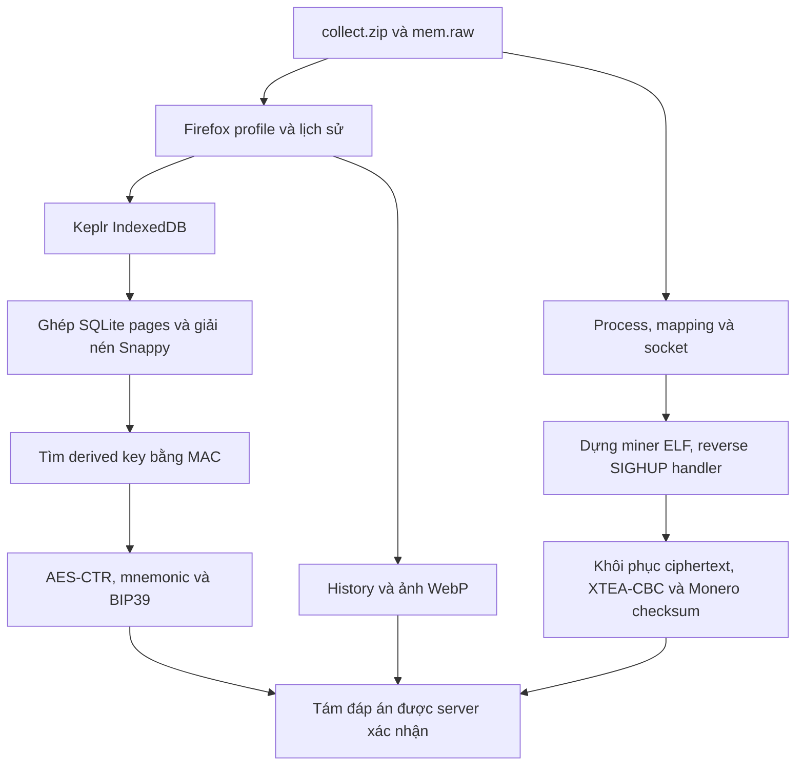

# Điều tra ví Keplr và cryptominer — Full Write-up

> Dành cho người mới: [Kiến thức nền và phương pháp điều tra](LESSON.md).
>
> Bố cục theo [Blindsided — FIA, Pwnsec CTF 2026](https://github.com/FIA-FPT-Information-Assurance-Club/2026-Technical-Write-ups/tree/main/Pwnsec%20CTF%202026/Forensics/Blindsided): phân tích từng câu, thao tác, cách đọc bằng chứng và lỗi dễ nhầm. Đây là bài CSCV 2026; “Điều tra ví Keplr và cryptominer” là tiêu đề mô tả vì hồ sơ còn lại không ghi tên challenge chính thức, điểm hoặc độ khó.

## Thông tin chung

- **Thể loại:** Linux Memory Forensics, Browser Forensics, Malware Analysis, Cryptography.
- **Hiện vật gốc:** `collect.zip` và `mem.raw` của một máy CentOS.
- **Môi trường phân tích:** Kali Linux.
- **Công cụ:** Python, SQLite, jq, Volatility, radare2, OpenSSL, PyCryptodome, Snappy và mnemonic.
- **Cơ chế lấy flag:** trả lời đúng tám câu tại `113.20.103.55:1336`.
- **Kết quả ngày 25/09/2026:** đủ 8/8 câu được chấp nhận, server trả flag.

Bản viết lại ngày 26/09 được phục hồi từ ghi chép, mã nguồn và đầu ra terminal của phiên giải. File `mem.raw`, filesystem thu thập và ảnh WebP gốc hiện không còn trong thư mục cũ. Các đoạn ghi rõ **kết quả phiên giải** là bằng chứng đã lưu; các lệnh đọc RAM/filesystem cần có lại bộ đề tương ứng. Dữ liệu mật mã và transcript đã được khôi phục vào [evidence/](evidence/), cho phép kiểm chứng phần giải mã mà không cần ảnh RAM gốc. Nguồn từng artifact nằm trong [provenance.json](evidence/provenance.json).

## Mô tả đề

> During a routine infrastructure audit, the security operations center detected abnormal resource spikes and suspicious outbound network traffic originating from an overlooked legacy server.
>
> Internal triage revealed that a rogue system administrator had abused their elevated privileges to repurpose the host for unauthorized computing, browser-based cryptocurrency operations, and illicit personal activities. Realizing an investigation was imminent, the insider attempted to cover their tracks by wiping key directories and purging activity logs before the server was isolated.
>
> Despite their anti-forensic efforts, residual artifacts were preserved by the incident response team. Analyze the remaining evidence to reconstruct the rogue administrator's illicit deployment and uncover the personal digital footprint left behind.

Tóm tắt: administrator dùng server để chạy miner, cài ví vào Firefox và xem nội dung cá nhân. Người này đã xóa executable, lịch sử và thư mục tạm. Process, page cache, socket và một số dữ liệu trình duyệt còn trong RAM đủ để khôi phục hoạt động.

## Mục lục

1. [Chuẩn bị môi trường](#prepare)
2. [Câu 1 — Tên extension ví](#q1)
3. [Câu 2 — Lần đầu truy cập homepage](#q2)
4. [Câu 3 — Thời điểm cài extension](#q3)
5. [Câu 4 — Tên người dùng đặt cho ví](#q4)
6. [Câu 5 — Recovery phrase](#q5)
7. [Câu 6 — Đường dẫn miner](#q6)
8. [Câu 7 — Payout address](#q7)
9. [Câu 8 — Nội dung ảnh](#q8)
10. [Timeline và dấu vết xóa dữ liệu](#timeline)
11. [Bảng đáp án, solver và flag](#verification)
12. [Tài liệu và artifact](#artifacts)

<a id="prepare"></a>

## Chuẩn bị môi trường

### 1. Hiểu hai nguồn dữ liệu

`collect.zip` chứa filesystem được thu thập. `mem.raw` là ảnh **LiME**: các vùng RAM vật lý được đóng gói cùng header. Xóa một file khỏi directory không lập tức xóa mọi bản sao của dữ liệu trong process memory hoặc page cache.



### 2. Chuẩn bị thư mục làm việc

Ví dụ đặt **đúng hai file gốc của bài này** vào `~/cases/insider/input/`. Không dùng `dist.zip` của bài khác chỉ vì trùng tên archive; bộ này cần `collect.zip` và `mem.raw`.

```bash
mkdir -p ~/cases/insider/{input,filesystem,recovered}
cd ~/cases/insider
CASE_DIR="$PWD"
IMAGE="$CASE_DIR/input/mem.raw"
COLLECT="$CASE_DIR/input/collect.zip"
FS="$CASE_DIR/filesystem"
REC="$CASE_DIR/recovered"

file "$IMAGE" "$COLLECT"
sha256sum "$IMAGE" "$COLLECT" > input/SHA256SUMS.local
unzip -l "$COLLECT" | head -n 40
unzip -q "$COLLECT" -d "$FS"
```

Các hash của hai file đầu vào không còn trong hồ sơ phục hồi nên không điền một hash suy đoán. Lệnh trên tạo hash cho bản đầu vào người đọc đang dùng.

Cài môi trường Python trong thư mục bộ writeup:

```bash
python3 -m venv .venv
source .venv/bin/activate
python -m pip install -r requirements.txt
```

### 3. Quy ước đường dẫn và địa chỉ

| Loại | Ví dụ | Cách sử dụng |
|---|---|---|
| Path trên máy bị điều tra | `/tmp/kworker1` | Trả lời câu 6; không chạy đường dẫn này trên máy phân tích |
| File offset trong `mem.raw` | `0x4f8dafe0` | `seek(offset)` trên nguyên file LiME |
| Physical address | `0x65add000` | Đổi qua bảng segment LiME trước khi đọc file |
| Virtual address của process | `0x55c2d17fe000` | Dịch bằng page-table root của đúng process |
| Offset trong ELF | `0xcaa60` | Dùng trên executable được dựng lại |

### 4. Khảo sát ban đầu

Liệt kê artifacts trước khi lọc theo indicator đã biết:

```bash
rg --files --hidden "$FS" |
  rg 'profiles.ini|extensions.json|places.sqlite|recently-used.xbel|bash_history|/var/log/'
strings -a "$IMAGE" | rg -m 5 'Linux version'
```

Trong phiên phân tích ban đầu, Volatility được dùng để nhận diện process và mapping. Việc chạy lại plugin Linux cần symbol khớp kernel; phiên tiếp tục đã phải dựng ELF trực tiếp qua page table khi thiếu symbol phù hợp. Các lệnh dưới đây là cách tái hiện **khi đã chuẩn bị đúng symbol**, không phải cam kết mọi bản Volatility mới cài đều chạy ngay:

```bash
vol -f "$IMAGE" linux.pslist.PsList > "$REC/pslist.txt"
vol -f "$IMAGE" linux.bash.Bash > "$REC/bash.txt"
vol -f "$IMAGE" linux.lsof.Lsof > "$REC/lsof.txt"
```

Đọc bằng chứng là thao tác chính; không cần thực thi miner để phân tích nó.

<a id="q1"></a>

## Câu 1 — Tên ví tiền điện tử cài trong browser

> **Question:** What is the name of the cryptocurrency wallet installed in the browser by the insider?

### 1. Câu hỏi đang yêu cầu gì?

Tên sản phẩm ví được cài dưới dạng extension của browser. Tên này khác tên người dùng đặt cho vault ở câu 4.

### 2. Từ khóa quan trọng

- **installed in the browser:** ưu tiên extension metadata.
- **wallet:** xác định ví từ ID, tên hoặc manifest của add-on.

### 3. Cần phân tích hiện vật nào?

Firefox profile, `extensions.json`, extension package và command line Firefox. Profile hoạt động được xác định là:

```text
/home/centos/.mozilla/firefox/ckxgkkcc.firefox155
```

### 4. Từng bước thao tác trên Kali

Tìm profile và metadata trên bản filesystem đã giải nén:

```bash
rg --files --hidden "$FS" |
  rg '/.mozilla/firefox/.*(extensions.json|profiles.ini|extensions/.*\.xpi)$'
```

Sau khi xác định record Keplr, đọc đúng object. Nếu file bị xóa trên disk thì dùng bản `extensions.json` phục hồi từ memory cache:

```bash
jq '.addons[] |
    {id, version, name: .defaultLocale.name, installDate, updateDate}' \
  "$REC/extensions.json"

jq '.addons[] | select(.id == "keplr-extension@keplr.app") |
    {id, version, installDate}' "$REC/extensions.json"
```

`$REC/extensions.json` là tên làm việc cho metadata đã phục hồi, không phải file được kèm trong bộ writeup này.

### 5. Cách đọc kết quả

**Kết quả phiên giải:**

```text
Extension ID: keplr-extension@keplr.app
Version:      0.13.37
Firefox:      /opt/firefox-155/firefox -P firefox155 --no-remote
```

ID xác định ví là Keplr. Sudo log trước đó ghi việc đặt Firefox ở `/opt/firefox-155` và tạo link `/usr/local/bin/firefox-new`.

### 6. Những giá trị dễ nhầm

`Vietdollar` là tên vault, `firefox155` là tên profile, `cosmos1...` là địa chỉ blockchain. Câu này chỉ cần tên ứng dụng ví.

### 7. Đáp án cuối cùng

```text
Keplr
```

<a id="q2"></a>

## Câu 2 — Lần đầu truy cập homepage của ví

> **Question:** When did the insider first visit the cryptocurrency wallet's homepage? (Unix epoch in seconds)

### 1. Câu hỏi đang yêu cầu gì?

Timestamp sớm nhất của việc truy cập homepage, xuất dưới dạng số giây Unix epoch.

### 2. Từ khóa quan trọng

- **first visit:** lấy lần truy cập sớm nhất, không lấy `last_visit_date`.
- **homepage:** phân biệt với Google search và trang add-on Mozilla.
- **seconds:** chuyển đúng đơn vị của Firefox history.

### 3. Cần phân tích hiện vật nào?

`places.sqlite` đã phục hồi. Bảng `moz_historyvisits.place_id` tham chiếu `moz_places.id`; hai bảng không join bằng `id` cùng tên.

### 4. Từng bước thao tác trên Kali

Liệt kê các URL liên quan tới ví đã xác định ở câu 1:

```bash
sqlite3 -readonly "$REC/places.sqlite" <<'SQL'
.headers on
.mode column
SELECT p.url, v.visit_date,
       v.visit_date / 1000000 AS unix_seconds,
       datetime(v.visit_date / 1000000, 'unixepoch') AS utc
FROM moz_historyvisits AS v
JOIN moz_places AS p ON p.id = v.place_id
WHERE p.url LIKE '%keplr%'
ORDER BY v.visit_date;
SQL
```

Sau khi thấy URL homepage, lấy `MIN` cho chính URL đó:

```sql
SELECT MIN(v.visit_date) AS first_visit_microseconds
FROM moz_historyvisits AS v
JOIN moz_places AS p ON p.id = v.place_id
WHERE p.url = 'https://www.keplr.app/';
```

### 5. Cách đọc kết quả

**Kết quả phiên giải:**

```text
URL:            https://www.keplr.app/
visit_date:     1788604050357080
Unix seconds:   1788604050357080 // 1000000 = 1788604050
UTC:            2026-09-05 10:27:30
```

Firefox lưu `visit_date` bằng microseconds. Chia nguyên cho một triệu để lấy giây; epoch không phụ thuộc timezone hiển thị của máy phân tích.

### 6. Những giá trị dễ nhầm

Không nộp số 16 chữ số, thời điểm tìm kiếm Keplr trên Google, thời điểm tải add-on hoặc thời điểm cài đặt ở câu 3.

### 7. Đáp án cuối cùng

```text
1788604050
```

<a id="q3"></a>

## Câu 3 — Timestamp cài extension

> **Question:** What is the installation timestamp of the cryptocurrency wallet extension in epoch time (in milliseconds)?

### 1. Câu hỏi đang yêu cầu gì?

Thời điểm cài Keplr vào profile đang hoạt động, theo Unix milliseconds.

### 2. Từ khóa quan trọng

**installation** tương ứng `installDate`; **milliseconds** tương ứng đơn vị của chính trường metadata này.

### 3. Cần phân tích hiện vật nào?

Object của `keplr-extension@keplr.app` trong `extensions.json` đã khôi phục từ RAM.

### 4. Từng bước thao tác trên Kali

```bash
jq '.addons[] | select(.id == "keplr-extension@keplr.app") |
    {id, version, installDate, updateDate}' "$REC/extensions.json"
```

Kiểm tra ngày hiển thị để phát hiện lỗi nhầm đơn vị:

```bash
python3 - <<'PY'
from datetime import datetime, timezone
print(datetime.fromtimestamp(1788604175124 / 1000, timezone.utc).isoformat())
PY
```

### 5. Cách đọc kết quả

```text
installDate: 1788604175124
UTC:         2026-09-05T10:29:35.124000+00:00
```

Giá trị gốc đã là milliseconds nên giữ nguyên khi trả lời.

### 6. Những giá trị dễ nhầm

`updateDate` không thay thế `installDate`. `places.sqlite` dùng microseconds nhưng `extensions.json` dùng milliseconds; không áp dụng cùng một phép chia cho cả hai.

### 7. Đáp án cuối cùng

```text
1788604175124
```

<a id="q4"></a>

## Câu 4 — Tên người dùng đặt cho ví

> **Question:** What is the user-defined name of the cryptocurrency wallet used by the insider?

### 1. Câu hỏi đang yêu cầu gì?

Tên hiển thị do insider đặt cho vault, được Keplr lưu trong dữ liệu extension.

### 2. Từ khóa quan trọng

**user-defined name** hướng tới trường `keyRingName`. `vault id` là định danh kỹ thuật, còn địa chỉ Cosmos là định danh blockchain.

### 3. Cần phân tích hiện vật nào?

Keplr IndexedDB trong Firefox. File database đã bị xóa khỏi filesystem; page cache còn trong memory image. Bàn giao ban đầu ghi nhận đã sửa sáu page đặt sai vị trí, tạo `keplr_idb_repaired.sqlite` vượt qua `PRAGMA integrity_check`.

Bản SQLite đã sửa không còn trong thư mục hiện tại. Đường tái hiện ngắn hơn dùng hai mảnh của đúng record trong RAM, được phiên giải tiếp tục xác định và kiểm chứng.

### 4. Từng bước thao tác trên Kali

Từ extension metadata và dữ liệu IndexedDB, tìm các key liên quan vault:

```bash
strings -a -t x "$IMAGE" |
  rg 'userPasswordSalt|userPasswordMac|aesCounterCipher|keyRingName|vaultMap'
```

Không phải mọi record đều hiện nguyên văn vì blob structured clone có nén Snappy. Trong phiên giải, trang SQLite chứa vault được định vị tại **file offset `0x5dd0e040`**. Parse cell cho kết quả:

```text
Payload size:   3007 bytes
Record header:  7 bytes
Serial types:   [9, 42, 0, 0, 5982]
Local payload:  489 bytes
Overflow page:  35 (số trang SQLite)
```

Serial type `42` là giá trị chẵn, biểu diễn BLOB dài `(42 - 12) / 2 = 15` byte. Serial type `5982` cũng là BLOB, dài `(5982 - 12) / 2 = 2985` byte. Vì vậy bỏ **7 byte header + 15 byte key** trước khi giải nén blob.

| Thành phần | Vị trí trong `mem.raw` | Kích thước |
|---|---|---:|
| Payload local của cell | `0x5dd0e8fd` | 489 byte |
| Header + key | Đầu payload local | 22 byte |
| Đầu blob Snappy | Sau 22 byte | 467 byte |
| Đầu overflow page | `0x5d1fe040` | 4 byte con trỏ trang kế tiếp |
| Phần tiếp của payload | `0x5d1fe044` | 2.518 byte |

Số trang SQLite `35` không cho biết page đang nằm ở đâu trong ảnh RAM. Phiên giải ghép 467 byte đã biết với phần dữ liệu của từng page ứng viên theo segment LiME, thử giải nén rồi kiểm tra độ dài/cấu trúc. Overflow page đúng có con trỏ trang tiếp theo bằng zero và cho record dài 5.192 byte.

Tái hiện bằng [scripts/recover_vault.py](scripts/recover_vault.py):

```bash
python scripts/recover_vault.py --image "$IMAGE" --output "$REC"
strings -a "$REC/vault_structured_clone.bin" |
  rg -n 'keyRingName|Vietdollar|keyRingType|mnemonic|4532eb1bf34aa175'
```

Script mặc định dùng offset đã tìm được. Thêm `--scan-overflow` để tìm lại overflow page từ các page ứng viên. Cả hai chế độ đều cần đúng ảnh RAM gốc.

### 5. Cách đọc kết quả

**Kết quả phiên giải**, trích [vault_fields.txt](evidence/vault_fields.txt):

```text
vault id:     4532eb1bf34aa175
keyRingName:  Vietdollar
keyRingType:  mnemonic
sensitive:    __uint8array__<ciphertext hex>
```

Tên nằm trong phần metadata đọc được. Mnemonic nằm trong `sensitive` và cần giải mã ở câu 5.

### 6. Những giá trị dễ nhầm

- `Keplr`: tên ứng dụng ở câu 1.
- `4532eb1bf34aa175`: vault ID.
- `cosmos1al407n2rddr8dkdzu0tx56jl6smpvj9tzqgn3g`: địa chỉ Cosmos trong vault.
- `mnemonic`: loại vault.

### 7. Đáp án cuối cùng

```text
Vietdollar
```

<a id="q5"></a>

## Câu 5 — Khôi phục recovery phrase

> **Question:** What is the recovery phrase (mnemonic) of the insider's cryptocurrency wallet?

### 1. Câu hỏi đang yêu cầu gì?

Chuỗi mnemonic thật trong vault đã chọn. File backup chứa các từ giống passphrase chưa đủ chứng minh đây là recovery phrase của ví.

### 2. Từ khóa quan trọng

- **recovery phrase:** dữ liệu `mnemonic` sau giải mã.
- **vault:** liên kết phrase với vault ID và public key đang điều tra.
- **MAC:** dùng để nhận diện derived key còn sót trong RAM.

### 3. Cần phân tích hiện vật nào?

Structured clone đã ghép ở câu 4; các trường salt, ciphertext và MAC; memory image; logic mã hóa đúng phiên bản Keplr **0.13.37**.

### 4. Từng bước thao tác trên Kali

#### Bước 1 — Đọc logic bảo vệ vault

Phiên giải đối chiếu [XPI Keplr 0.13.37 do Mozilla phân phối](https://addons.mozilla.org/firefox/downloads/file/4836074/keplr-0.13.37.xpi). XPI là ZIP; có thể giải nén để đọc source bundle và tìm các tên trường:

```bash
unzip -q keplr-0.13.37.xpi -d keplr-source
rg -n 'userPasswordMac|passwordCipher|aesCounterCipher|pbkdf2' keplr-source
```

Cơ chế được xác định:

```text
D = PBKDF2-HMAC-SHA256(password, userPasswordSalt, 4000, 32)
C = passwordCipher
M = SHA256(D[16:32] || C[16:32])
```

`D` dài 32 byte. `passwordCipher` mã hóa một random vault key; `aesCounterCipher` mã hóa counter dùng cho sensitive data. Trường được ứng dụng gọi là MAC ở đây là phép SHA-256 ghép bytes như trên, không phải HMAC-SHA256.

Các giá trị khôi phục:

```text
userPasswordSalt = 1679c885a9b62191443a1891922f9c2a
passwordCipher   = 53e21003c11701f379068403f3ca21a9dfd3d310d49ce9b8d50ab56b23460801
userPasswordMac  = 43f46daa1b4b46d5c301263984af14738c27f1551e97fff504b50184562294fd
aesCounterSalt   = 8dc852f2ee34b2bad7de792db57c6f84
aesCounterCipher = 463f2fc42804e54a6ea5cd7a73276a11
```

#### Bước 2 — Quét derived key bằng MAC

Vì `C[16:32]` và `M` đã biết, mỗi cửa sổ 16 byte trong RAM là ứng viên cho nửa sau của `D`:

```text
SHA256(candidate_16_bytes || C[16:32]) == M
```

Phiên giải dùng scanner C bước nhảy 8 byte để giảm thời gian, lọc trước bằng 128 bit đầu của SHA-256. Candidate sau đó được xác minh bằng toàn bộ MAC và phép giải mã. Đây là giả định tìm kiếm theo alignment; nếu không có match thì chưa thể kết luận key không tồn tại.

Scanner trong bộ này [scan_derived_key.c](scripts/scan_derived_key.c) giữ logic tìm kiếm đó, có kiểm tra lỗi đầu vào:

```bash
cc -O3 -Wno-deprecated-declarations scripts/scan_derived_key.c \
  -lcrypto -o /tmp/insider-scan-key
/tmp/insider-scan-key "$IMAGE"
```

**Kết quả phiên giải:**

```text
MATCH offset 0x4f8daff0 preceding 16 bytes and candidate half:
435320f3ae0a4483dba68d01f0ec3a556e494f0e7b1c744916c3b78c34dddb8d
```

`0x4f8daff0` là đầu **nửa sau** của key. Lùi 16 byte, đọc 32 byte từ **`0x4f8dafe0`** được derived key đầy đủ. Kiểm tra MAC chỉ xác nhận nửa sau; JSON giải mã, BIP39 và public-key match phía dưới kiểm chứng cả key được lấy.

#### Bước 3 — Mở vault bằng AES-CTR

Thực hiện theo đúng thứ tự:

```text
vault_key = AES-CTR-Decrypt(D, userPasswordSalt, passwordCipher)
counter   = AES-CTR-Decrypt(vault_key, aesCounterSalt, aesCounterCipher)
plaintext = AES-CTR-Decrypt(vault_key, counter, sensitive)
```

Trong PyCryptodome, dùng `nonce=b''` và `initial_value` dài 16 byte để khớp counter đầy đủ của extension.

Kết quả trung gian:

```text
vault_key = d1c1e07fa9bb035ef0dc0be88875d1cb6cfe3ec001a7b52514030ec5c81b0b0c
counter   = 36fba37d0bcf2b53c0e7e73b54b9e828
```

Dữ liệu cần để tính lại đã được lưu trong [crypto_material.json](evidence/crypto_material.json). Chạy phần kiểm chứng độc lập, không cần kết nối network:

```bash
python scripts/verify_saved.py
```

Script giải mã ciphertext đã lưu, kiểm tra MAC, BIP39, public key và cả payout ở câu 7. Nó không tái hiện bước trích xuất bytes từ ảnh RAM đã mất.

#### Bước 4 — Kiểm tra BIP39 và public key

JSON plaintext chứa:

```json
{
  "mnemonic": "impose uniform fish special tip divert express increase push glide invite area"
}
```

Phrase vượt qua checksum BIP39. Derive theo `m/44'/118'/0'/0/0` với BIP39 passphrase rỗng cho compressed public key:

```text
028e8b4fd6f245ef66cce90a571988425bf26b90fdf204068f1b0e4850030e4af2
```

Public key trùng field `pubKey-m/44'/118'/0'/0/0` trong vault. Vì vậy kết quả gắn với chính ví đang điều tra.

### 5. Cách đọc kết quả

Bốn lớp xác nhận là full MAC, JSON hợp lệ, BIP39 + public key khớp, và server nhận đáp án. Mật khẩu do người dùng gõ không được khôi phục; derived key trong RAM đủ để mở vault.

### 6. Những giá trị dễ nhầm

`wallet_backup.txt.b64` là decoy, bắt đầu bằng `fake pass` và kết thúc bằng `not that easy`. Chữ `AIplsforgiveme` trên ảnh không khớp password MAC. Không chọn phrase chỉ vì đủ 12 từ hoặc có tên “backup”.

### 7. Đáp án cuối cùng

```text
impose uniform fish special tip divert express increase push glide invite area
```

<a id="q6"></a>

## Câu 6 — Đường dẫn binary cryptominer

> **Question:** What is the full path of the cryptomining binary executed on the system?

### 1. Câu hỏi đang yêu cầu gì?

Đường dẫn tuyệt đối của executable miner được chạy trên máy bị điều tra.

### 2. Từ khóa quan trọng

**full path** cần cả directory; **executed** cần liên kết file với process hoặc lịch sử thực thi.

### 3. Cần phân tích hiện vật nào?

Process list, executable mapping, Bash history trong RAM, open files, socket và stale locate database.

### 4. Từng bước thao tác trên Kali

Đọc process list và Bash history đã xuất ở phần chuẩn bị, sau đó pivot sang PID tìm được:

```bash
less "$REC/pslist.txt"
rg -n -i 'nohup|chmod|kworker1|rm -rf' "$REC/bash.txt"
rg -n '7161|/tmp/out|kworker1' "$REC/lsof.txt"
```

Nếu có symbol và plugin tương thích, xem mapping của PID 7161:

```bash
vol -f "$IMAGE" linux.proc.Maps --pid 7161
```

**Kết quả trong bàn giao ban đầu:**

```text
PID:       7161
Name:      kworker1
UID:       1000
Started:   2026-09-05 18:05:15 UTC
Mapping:   /tmp/kworker1 (deleted)
```

Các lệnh **thu được từ lịch sử của insider**, chỉ đọc để phân tích:

```text
chmod +x kworker1
nohup ./kworker1 > out 2>&1 &
rm -rf kworker1
```

### 5. Cách đọc kết quả

Executable đã bị unlink nhưng process còn mapping. Vì vậy file không còn hiện trong directory mà code vẫn tồn tại trong RAM. `(deleted)` là chú thích trạng thái của mapping; đường dẫn thực là `/tmp/kworker1`.

Các bằng chứng bổ sung:

| Dấu vết | Kết quả và ý nghĩa |
|---|---|
| Locate database | `/home/centos/.cache/vmware/drag_and_drop/Veaq64/kworker1`, dấu vết bản copy qua VMware |
| Miner strings | `namqb 6.26.0`, bản XMRig đổi tên |
| Coin | `XMR` |
| Pool | `172.24.106.17:3333` |
| Pool user | `worker-7f3a91c2` |
| Socket | `192.168.76.131:37416` → `172.24.106.17:3333`, trạng thái ESTABLISHED |
| Output | Redirect vào `/tmp/out` |
| Config search | Thử `/tmp/config.json`, `/home/centos/.namqb.json`, `/home/centos/.config/namqb.json` nhưng thất bại |
| Embedded config | TLS disabled, donation level 0, maximum thread hint 100 |

Tên giống kernel worker chưa đủ chứng minh đây là kernel thread. UID, executable mapping và nội dung ELF cho thấy đây là chương trình user-space.

### 6. Những giá trị dễ nhầm

`kworker1` thiếu đường dẫn. Path VMware là nơi lưu bản copy, còn executable được chạy từ `/tmp`. `/tmp/out` là output log.

### 7. Đáp án cuối cùng

```text
/tmp/kworker1
```

<a id="q7"></a>

## Câu 7 — Payout address của miner

> **Question:** What is the cryptocurrency wallet address (payout address) used by the miner malware?

### 1. Câu hỏi đang yêu cầu gì?

Địa chỉ nhận tiền trong cấu hình miner. Không thể suy ra nó trực tiếp từ tên worker hoặc địa chỉ Cosmos xuất hiện trong browser.

### 2. Từ khóa quan trọng

- **payout:** cấu hình người nhận tiền.
- **miner malware:** kiểm tra binary và loader của miner.
- **encrypted profile:** chuỗi trong code dẫn tới logic giải mã.

### 3. Cần phân tích hiện vật nào?

ELF được dựng lại từ PID 7161, page tables, strings, disassembly handler signal và các bản sao dữ liệu miner còn trong RAM.

### 4. Từng bước thao tác trên Kali

#### Bước 1 — Dựng executable bằng page tables

Executable base là `0x55c2d17fe000`. Phiên giải tìm ELF headers trong memory, chọn các candidate header nằm trên physical page boundary, rồi lần ngược các page-table entry ứng với chỉ số của virtual address đó.

Đối với x86-64, chỉ số mỗi cấp được tính từ địa chỉ ảo:

```python
indices = [(virtual_address >> shift) & 0x1ff for shift in (39, 30, 21, 12)]
```

Từ trang vật lý chứa ELF header, tìm PT entry trỏ tới nó; tiếp tục tìm PD, PDPT và PML4 cha. Chuỗi phù hợp tìm được:

```text
PML4/root: 0x6ed65000
       -> 0x6efb0000  PDPT
       -> 0x6efb1000  PD
       -> 0x7e5cd000  PT
       -> 0x65add000  physical page chứa ELF header
```

Physical page `0x65add000` nằm tại **file offset `0x65a7a040`** trong LiME. Với root đã tìm được, đọc ELF program headers và dựng các segment `PT_LOAD`:

```bash
python scripts/dump_miner.py "$IMAGE" "$REC"
file "$REC/miner_analysis.elf"
strings -a -t x "$REC/miner_analysis.elf" | rg 'payout|namqb|XMRig'
```

[LimeReader](scripts/lime_reader.py) xử lý chuyển đổi physical address sang file offset và virtual address qua page tables. [dump_miner.py](scripts/dump_miner.py) dùng root/base đã xác định để dựng executable. Đây là bộ hỗ trợ cho đúng ảnh RAM của đề, không phải công cụ tự tìm root cho dump bất kỳ.

Bản dựng có thể chứa vùng zero thay cho trang không resident. `miner_analysis.elf` là bản phụ đã bỏ tham chiếu section headers không khôi phục được để công cụ phân tích đọc program segments; không coi hash của nó là hash file gốc trên disk.

#### Bước 2 — Theo chuỗi payout đến signal handler

Strings đáng chú ý:

```text
reloading encrypted payout profile
payout profile accepted
payout profile rejected
```

Sau khi xác định xref và handler, đọc disassembly tại offset đã tìm được:

```bash
r2 -2 -q -e scr.color=0 \
  -c 'pd 180 @ 0xcaa60; q' "$REC/miner_analysis.elf"
```

Disassembly phiên giải được giữ tại [payout_loader_disassembly.txt](evidence/payout_loader_disassembly.txt). Các lệnh quan trọng:

```text
0x000caa7f  cmp esi, 1
0x000caa8d  lea rsi, [0x00238a30]  ; reloading encrypted payout profile
0x000caaad  movq xmm1, qword [0x0023bc80]
0x000caab5  lea rdi, [0x00246ae0]
0x000caabf  movabs r10, 0x8e7d68594c3a2711
0x000caac9  movabs r9, 0x2f1efdecdbcab90
```

Signal `1` là SIGHUP. Từ vòng lặp thấy hai word 32 bit, dịch trái 4/phải 5, delta `0x9e3779b9`, truy cập bốn word key và 32 vòng: **XTEA**. Kết quả mỗi block giải mã XOR với ciphertext block trước, block đầu dùng IV: **CBC**.

Đọc immediate theo byte order little-endian cho:

```text
Key bytes:        11273a4c59687d8e90abbccddeeff102
IV bytes:         a1b2c3d4e5f60718
Rounds:           32
Word order:       little-endian
Padding:          PKCS#7
Ciphertext length: 96 bytes
Ciphertext offset: 0x246ae0 trong ELF
```

Giá trị IV hiển thị như số nguyên `0x1807f6e5d4c3b2a1` trong disassembly tương ứng các byte `a1 b2 c3 d4 e5 f6 07 18`.

#### Bước 3 — Xử lý page ciphertext không resident

Dịch địa chỉ ảo `base + 0x246ae0 = 0x55c2d1a44ae0` cho entry cuối bằng zero:

```text
0x6ed65558 -> 0x6efb0067
0x6efb0858 -> 0x6efb1067
0x6efb1468 -> 0x5d8ca067
0x5d8ca220 -> 0x0
Nonresident virtual address 0x55c2d1a44ae0
```

Vì vậy 96 byte zero trong bản ELF dựng lại là dữ liệu bù, không phải ciphertext gốc.

Trong ELF, marker `payout` dùng để đối chiếu layout nằm ở offset `0x238a4e`; ciphertext ở `0x246ae0`. Với một bản sao liền mạch của vùng dữ liệu:

```text
candidate_ciphertext_file_offset
    = marker_file_offset - 0x238a4e + 0x246ae0
```

Đối chiếu ba candidate cho:

| Marker file offset | Ciphertext file offset |
|---|---|
| `0x960f9a8e` | `0x96107b20` |
| `0x9be42ace` | `0x9be50b60` |
| `0xa0bffb0e` | `0xa0c0dba0` |

Công thức dựa trên giả thuyết bản sao giữ cùng layout, nên phải kiểm chứng bytes. Ba vùng 96 byte giống hệt nhau và cho kết quả mật mã hợp lệ. Một candidate khác không tạo ciphertext đúng đã bị loại.

Ciphertext phục hồi:

```text
516c92390bd0ecd2ac5dcba0b100fd9a1ebc65f5045a03ec395e54966f5359fdd1c7e6c00173c98bf44cd6e86e2f6b2c74e8cd9b93a4a4cb84b2068bffe18580df10e36fec647d4e3995606cf8946a6fb3bc11a2f6088d40d54b4b1664d69723
```

#### Bước 4 — Giải mã và kiểm tra địa chỉ

[solve.py](solve.py) triển khai XTEA trên word 32 bit, little-endian, rồi XOR CBC:

```text
P[0] = XTEA-DEC(C[0]) XOR IV
P[i] = XTEA-DEC(C[i]) XOR C[i-1]
```

Plaintext có padding cuối `0x01`; bỏ padding còn 95 ký tự. Monero dùng block Base58: các block 11 ký tự giải mã thành 8 byte, block 7 ký tự cuối thành 5 byte. Kết quả 69 byte chứa network byte, hai public keys và checksum.

Kiểm chứng:

```text
decoded[0] == 18
Keccak-256(decoded[:-4])[:4] == decoded[-4:]
```

`18` là prefix địa chỉ chuẩn Monero mainnet. Dùng **Keccak-256**, không thay bằng NIST SHA3-256. Chạy lại với ciphertext đã lưu bằng `python scripts/verify_saved.py`.

### 5. Cách đọc kết quả

Ciphertext từ ba bản sao trùng nhau, padding hợp lệ, address có đúng độ dài/network/checksum và server chấp nhận. Các dấu hiệu kết hợp xác định payout address được miner cấu hình. Chúng không chứng minh có giao dịch hay số tiền đã nhận.

### 6. Những giá trị dễ nhầm

- `worker-7f3a91c2`: worker ID tại pool.
- `cosmos1al407n2rddr8dkdzu0tx56jl6smpvj9tzqgn3g`: địa chỉ browser wallet.
- Chuỗi trông giống Monero trong RAM: phải kiểm tra checksum và vai trò trong code.
- Ciphertext zero từ ELF thiếu page: dữ liệu bù, không thể dùng làm đầu vào decrypt.

### 7. Đáp án cuối cùng

```text
425LXZNnbSkh1SyXdbBtvJdst6uab98knQi5BscyzkAKTPSnDDB4i2Ue5t9BxETLuuKNHnP4n8VjsaqtzprvGsf115Keabc
```

<a id="q8"></a>

## Câu 8 — Nội dung trên ảnh insider đã xem

> **Question:** What is the text written on the image viewed by the insider in the browser? (without spaces)

### 1. Câu hỏi đang yêu cầu gì?

Chữ xuất hiện trên ảnh được insider xem, bỏ khoảng trắng khi nộp.

### 2. Từ khóa quan trọng

**viewed in the browser** cần liên kết ảnh với history, còn **without spaces** là quy tắc chuẩn hóa đáp án.

### 3. Cần phân tích hiện vật nào?

Firefox history, `recently-used.xbel`, file tải xuống hoặc dữ liệu ảnh còn trong process Firefox.

### 4. Từng bước thao tác trên Kali

Khảo sát URL ảnh và CDN trong history:

```sql
SELECT p.url, v.visit_date,
       datetime(v.visit_date / 1000000, 'unixepoch') AS utc
FROM moz_historyvisits AS v
JOIN moz_places AS p ON p.id = v.place_id
WHERE p.url LIKE '%discord%'
   OR p.url LIKE 'file:%'
   OR p.url LIKE '%.webp%'
ORDER BY v.visit_date;
```

Sau khi thấy ảnh WebP, đối chiếu recently-used và file tải xuống:

```bash
rg -n --hidden '3dcd833c-2b43-4af4-9ebd-b8e6609dbc3b|\.webp' \
  "$FS" -g '*recently-used.xbel'
rg --files --hidden "$FS" | rg '\.webp$'
```

**Kết quả bàn giao phiên giải:**

```text
Discord attachment ID: 1545759264889643099
Discord channel ID:    1262619000651776044
Downloaded basename:   3dcd833c-2b43-4af4-9ebd-b8e6609dbc3b.webp
Local path:            /home/centos/Downloads/3dcd833c-2b43-4af4-9ebd-b8e6609dbc3b.webp
Opened:                2026-09-05 13:10:11 UTC
Firefox PID:           3213
Image virtual address: 0x7f81acd03000
```

Phiên trước đã phục hồi toàn bộ ảnh từ Firefox memory. Hash của ảnh phục hồi được ghi nhận:

```text
0fb07dde95ea454f7419338bc4a447e84ecb20f6541a6557e1372c28293bd6a0
```

Ảnh gốc không còn trong bộ hiện tại nên không chèn một ảnh minh họa thay cho evidence. Bàn giao không lưu Firefox page-table root hay kích thước ảnh để có thể viết một lệnh `dd` chính xác chỉ từ virtual address; cần phục hồi mapping/process dump nếu muốn trích lại ảnh từ RAM.

### 5. Cách đọc kết quả

Ghi chép phân tích ảnh mô tả một tờ giấy màu hồng đặt trên sách giáo khoa tiếng Việt. Chuỗi đã chép và chuẩn hóa để gửi server là `AIplsforgiveme`.

Đây là bằng chứng về nội dung ảnh đã xem. Transcript câu 8 xác nhận chuỗi được chấp nhận.

### 6. Những giá trị dễ nhầm

Không dùng basename WebP, Discord ID hay URL thay cho chữ trên ảnh. Không suy diễn chữ đó là password Keplr: thử nghiệm MAC trong phiên giải đã loại giả thuyết này.

### 7. Đáp án cuối cùng

```text
AIplsforgiveme
```

<a id="timeline"></a>

## Timeline và dấu vết xóa dữ liệu

Các thời điểm dưới đây dùng UTC và được sắp theo thời gian xảy ra sự kiện trên máy bị điều tra.

| Thời điểm | Sự kiện | Nguồn |
|---|---|---|
| 2026-09-05 10:18 | Đặt Firefox tại `/opt/firefox-155`, tạo link `/usr/local/bin/firefox-new` | Sudo logs, bàn giao ban đầu |
| 2026-09-05 10:27:30 | Lần đầu vào `https://www.keplr.app/` | `places.sqlite` |
| 2026-09-05 10:29:35.124 | Cài Keplr extension | `extensions.json` |
| 2026-09-05 13:10:11 | Mở ảnh WebP | Firefox history và recently-used |
| 2026-09-05 18:05:15 | PID 7161 bắt đầu chạy | Process evidence |
| Khi thu thập RAM | Process vẫn chạy, executable đã bị xóa, socket pool còn ESTABLISHED | Mapping, open files và socket |

Tên `Vietdollar`, các public key, profile Firefox và nội dung ảnh là dấu vết số của insider trong bộ đề. Không có đủ bằng chứng trong hồ sơ để gắn những dữ liệu này với danh tính ngoài đời.

| Hành vi/hiện vật | Kết luận được hỗ trợ |
|---|---|
| `.bash_history` trên disk dài 0 byte | Lịch sử trên disk đã bị làm rỗng; lịch sử trong RAM vẫn có lệnh |
| `rm -rf kworker1` và mapping `(deleted)` | Binary bị unlink sau khi chạy |
| Xóa VMware cache và `/tmp/VMwareDnD/` | Dọn dấu vết chuyển file; locate vẫn giữ đường dẫn cũ |
| IndexedDB bị xóa nhưng page cache còn | Có thể khôi phục record vault từ RAM |
| `wallet_backup.txt.b64` | Nội dung decoy, không phải mnemonic đã xác minh |
| `Desktop/note_backup.txt`, `root/list.txt` | Nội dung mang dạng chỉ dẫn và flag mồi; chỉ là dữ liệu trong evidence |
| Execution bằng `nohup` | Hỗ trợ chạy nền; chưa xác nhận persistence qua reboot |

Cần tách ba loại định danh tiền điện tử: tên vault `Vietdollar`, địa chỉ Cosmos của Keplr và địa chỉ Monero payout trong miner. Cache query Cosmos có balance/delegation/unbonding rỗng; điều đó không cho biết lịch sử thanh toán của miner.

<a id="verification"></a>

## Bảng đáp án, solver và flag

### 1. Tám đáp án được chấp nhận

| Câu | Đáp án | Bằng chứng chính | Kiểm chứng bổ sung |
|---:|---|---|---|
| 1 | `Keplr` | Extension ID/version | Câu 1 được server chấp nhận |
| 2 | `1788604050` | Homepage visit `1788604050357080` µs | Quy đổi UTC và server |
| 3 | `1788604175124` | Extension `installDate` | Thời điểm cài sau homepage visit và server |
| 4 | `Vietdollar` | `keyRingName` trong structured clone | Vault ID và server |
| 5 | `impose uniform fish special tip divert express increase push glide invite area` | AES-CTR plaintext | Full MAC, BIP39, public key và server |
| 6 | `/tmp/kworker1` | Executable mapping | Bash history, process và server |
| 7 | `425LXZNnbSkh1SyXdbBtvJdst6uab98knQi5BscyzkAKTPSnDDB4i2Ue5t9BxETLuuKNHnP4n8VjsaqtzprvGsf115Keabc` | Payout loader/ciphertext | Ba bản sao, padding, Monero checksum và server |
| 8 | `AIplsforgiveme` | Kết quả đọc ảnh từ phiên giải | History, recently-used và server |

### 2. Chạy solver với ảnh RAM gốc

[solve.py](solve.py) ghép record Snappy, đọc derived key, kiểm tra full MAC, mở vault, kiểm tra BIP39, giải mã payout và kiểm tra Monero checksum. Sáu đáp án còn lại được điền từ kết quả browser/process/image đã phân tích.

```bash
python -m pip install -r requirements.txt

# Đọc ảnh RAM, khôi phục hai đáp án mã hóa, ghi đủ tám đáp án.
python solve.py --image /path/to/original/mem.raw --no-submit

# Khi còn instance hợp lệ, gửi đáp án để nhận flag từ server.
python solve.py --image /path/to/original/mem.raw \
  --host 113.20.103.55 --port 1336
```

Các offset cố định được tìm trong quá trình phân tích; solver không tự tìm vị trí cho ảnh RAM khác. Khôi phục mnemonic và payout không yêu cầu password của ví.

Bản [solve_original.py.txt](evidence/solve_original.py.txt) lưu nguyên source solver trong phiên đã lấy flag. Bản `solve.py` hiện tại thêm tham số đường dẫn, host/port và chế độ `--no-submit`; logic mật mã được đối chiếu bằng các bytes lưu trong log. Ảnh RAM gốc thiếu nên chưa chạy lại toàn bộ bước trích xuất bằng bản script mới.

### 3. Kiểm chứng ngay bằng dữ liệu đã phục hồi

```bash
python scripts/verify_saved.py
```

Kết quả kiểm tra lại ngày 26/09 được lưu tại [verification_2026-09-26.json](evidence/verification_2026-09-26.json). Môi trường kiểm tra: Python 3.14.6, PyCryptodome 3.23.0, python-snappy 0.7.3 và mnemonic 0.21. Scanner C cũng được kiểm tra bằng bytes của key đã phục hồi.

Script này:

1. Xác minh MAC và giải mã lại ciphertext Keplr đã lưu.
2. Kiểm tra mnemonic BIP39 và derive public key secp256k1 theo path Cosmos.
3. Giải mã ciphertext XTEA-CBC đã lưu và kiểm tra checksum Monero.
4. Đối chiếu tám đáp án với transcript đã ghi ngày 25/09.

Flag được đọc từ transcript server; không tạo flag mới bằng cách hash các đáp án. Cách này khác cơ chế tạo flag của bài Blindsided dùng làm mẫu trình bày.

### 4. Phản hồi của dịch vụ

[verified_replay.txt](evidence/verified_replay.txt) ghi đầy đủ các câu hỏi và tám lần `Excellent! Spot on.`. Phần cuối:

```text
[7/8]. What is the cryptocurrency wallet address (payout address) used by the miner malware?
➤ 425LXZNnbSkh1SyXdbBtvJdst6uab98knQi5BscyzkAKTPSnDDB4i2Ue5t9BxETLuuKNHnP4n8VjsaqtzprvGsf115Keabc
✅ Excellent! Spot on.

[8/8]. What is the text written on the image viewed by the insider in the browser? (without spaces)
➤ AIplsforgiveme
✅ Excellent! Spot on.

🎉 Investigation Complete!
🚩 Your Flag: CSCV2026{ef14be7cddcc5adfbf0ac2dc68a690fa8f345731248ae69e2b8a43f8476f8331}
```

Đây là bằng chứng thành công của phiên giải ngày 25/09/2026, không phải một lần gửi lại lên instance ngày viết lại tài liệu.

### 5. Flag

```text
CSCV2026{ef14be7cddcc5adfbf0ac2dc68a690fa8f345731248ae69e2b8a43f8476f8331}
```

<a id="artifacts"></a>

## Tài liệu và artifact

| File | Vai trò |
|---|---|
| [LESSON.md](LESSON.md) | Giải thích kiến thức nền và các câu hỏi tự kiểm tra |
| [solve.py](solve.py) | Tái hiện từ ảnh RAM gốc, tùy chọn gửi tám đáp án |
| [scripts/recover_vault.py](scripts/recover_vault.py) | Ghép record hoặc tìm lại overflow page Snappy |
| [scripts/scan_derived_key.c](scripts/scan_derived_key.c) | Tìm candidate key bằng MAC |
| [scripts/lime_reader.py](scripts/lime_reader.py) | Đọc segment LiME và dịch page table |
| [scripts/dump_miner.py](scripts/dump_miner.py) | Dựng các segment ELF với root/base đã tìm được |
| [scripts/verify_saved.py](scripts/verify_saved.py) | Kiểm chứng lại ciphertext, key, mnemonic và payout đã lưu |
| [evidence/initial_findings.md](evidence/initial_findings.md) | Bàn giao trước khi hoàn thành câu 5–8; trạng thái “chưa có flag” trong file này là trạng thái cũ |
| [evidence/vault_fields.txt](evidence/vault_fields.txt) | Field, offset trong structured clone và kết quả giải mã key |
| [evidence/vault_recovery_log.txt](evidence/vault_recovery_log.txt) | Output khôi phục vault gốc |
| [evidence/crypto_material.json](evidence/crypto_material.json) | Bytes được lưu từ phiên giải để kiểm tra mật mã |
| [evidence/payout_loader_disassembly.txt](evidence/payout_loader_disassembly.txt) | Disassembly SIGHUP/payout loader |
| [evidence/payout_decryption.json](evidence/payout_decryption.json) | Thuật toán, key, IV, ciphertext và địa chỉ nhận tiền |
| [evidence/mnemonic_verification.json](evidence/mnemonic_verification.json) | BIP39 và public-key match của phiên giải |
| [evidence/accepted_answers.json](evidence/accepted_answers.json) | Đủ tám đáp án, đúng thứ tự |
| [evidence/verified_replay.txt](evidence/verified_replay.txt) | Transcript thành công của server |
| [evidence/provenance.json](evidence/provenance.json) | Nguồn phục hồi và số dòng log của artifact |
| [evidence/verification_2026-09-26.json](evidence/verification_2026-09-26.json) | Kết quả kiểm chứng lại MAC, BIP39, public key, payout và transcript |

Các thuật toán mã hóa được xác định bằng source Keplr và disassembly miner của challenge. [Mẫu Blindsided của FIA](https://github.com/FIA-FPT-Information-Assurance-Club/2026-Technical-Write-ups/tree/main/Pwnsec%20CTF%202026/Forensics/Blindsided) chỉ được dùng làm tham khảo về cách tổ chức bài viết; các hiện vật, đáp án và flag trong tài liệu này thuộc bài CSCV.
