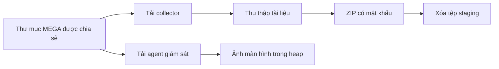

# CSCV 2026 — Bài học nhập môn điều tra bộ nhớ Linux

> Tài liệu dành cho người mới: học cách nối chứng cứ để trả lời bốn câu hỏi, đồng thời nhận ra khi nào một kết quả chưa đủ đáng tin.

## 1. Mục tiêu bài học

Sau bài này, học viên có thể:

1. Phân biệt ảnh nhớ vật lý, bộ nhớ tiến trình và tệp gốc.
2. Dùng tiến trình, lịch sử trình duyệt và terminal làm điểm bắt đầu.
3. Ánh xạ chủ sở hữu tệp đám mây tới đúng email.
4. Xác nhận tệp phục hồi trước khi tính hash.
5. Đọc logic tạo mật khẩu và kiểm chứng bằng dữ liệu ZIP.
6. Phân biệt chuỗi MD5 trong ảnh với MD5 của chính tệp ảnh.

## 2. Bức tranh tổng thể

Hiện vật gồm `dist/mem.dmp` và `dist/network.pcapng`. Ảnh nhớ là LiME của CentOS Stream 9, kernel `5.14.0-22.el9.x86_64`.

Lịch sử Coccoc ghi nhận hai tệp tải từ MEGA: `sys_audit_collector` và `kworker_daemon`. Terminal cho thấy collector đóng gói **39 tệp** vào `/tmp/documents_staging.zip`, rồi collector và ZIP bị xóa. Agent giám sát vẫn chạy khi bộ nhớ được thu giữ.



Đây là hướng điều tra tổng quát. Mỗi mắt xích cần chứng cứ riêng; tên tiến trình hoặc một chuỗi trong RAM chưa tự chứng minh toàn bộ hành vi.

## 3. Ba câu hỏi cho mỗi phát hiện

- **Đến từ đâu?** Ghi rõ tệp, PID, địa chỉ hoặc offset.
- **Chứng minh điều gì?** Một tên tệp, một thao tác đã xảy ra hay một khả năng trong mã?
- **Kiểm tra bằng gì?** Tìm nguồn thứ hai hoặc kiểm tra cấu trúc dữ liệu.

Ví dụ: terminal báo collector tạo ZIP là quan sát. Mã collector chỉ rõ đường dẫn và cách đặt mật khẩu là bằng chứng về logic. Các mục ZIP giải mã đúng CRC xác nhận mật khẩu thực sự dùng cho dữ liệu.

Giữ riêng bản gốc, tệp phục hồi và kết quả phân tích. Nếu chưa biết tệp đã phục hồi đầy đủ hay chưa, đặt trạng thái **ứng viên**, không đưa ngay vào bảng đáp án.

## 4. Lộ trình trả lời bốn câu hỏi

### Câu 1 — Tài khoản nào chứa malware?

**Hướng nghĩ:** đề hỏi tài khoản chứa tệp, vì vậy cần tìm chủ sở hữu của nút tệp. Email đang đăng nhập để xem thư mục có thể thuộc người khác.

Metadata MEGA của `sys_audit_collector` và `kworker_daemon` ghi owner handle:

```text
WKgaKPK93KU
```

Bản ghi người dùng trong RAM ánh xạ handle đó tới:

```text
tommyxiaomihackerbox@gmail.com
```

Giao diện thư mục chia sẻ còn lưu trong RAM cũng hiện cùng email tại `fm-share-email`. Hai nguồn này củng cố quan hệ **tệp → owner handle → email**.

**Bẫy:** `orbitjacklane@gmail.com` là tài khoản đang truy cập thư mục được chia sẻ. Chuỗi `tjacklane@gmail.com` cạnh nhãn giao diện từng khiến điều tra đi sai hướng. Vị trí gần một nhãn không mạnh bằng quan hệ metadata trực tiếp.

### Câu 2 — SHA-256 của collector ban đầu

**Hướng nghĩ:** phải hash đúng toàn bộ tệp gốc, không hash một vùng nhớ chỉ có ELF header.

Lịch sử tải xuống xác định tên `sys_audit_collector` và kích thước **23.360 byte**. Một đoạn RAM có đủ số byte này và bắt đầu bằng `7f 45 4c 46` vẫn chưa bảo đảm phần còn lại thuộc cùng tệp. Trang vật lý liên tiếp không nhất thiết tương ứng với các trang tệp liên tiếp.

Tệp nguyên vẹn đã được lấy lại từ MEGA sau khi thu giữ ảnh nhớ, lưu thành `D:\CTF\cscv\scratch\sys_audit_collector_from_mega.elf`. Bước lấy lại phụ thuộc dịch vụ MEGA còn cung cấp tệp; không phải một bản dựng toàn bộ ELF chỉ từ RAM. ELF hợp lệ và 4.096 byte đầu khớp trang cache được tìm độc lập trong ảnh nhớ. Sau đó mới tính SHA-256 trên toàn tệp:

```text
9ec3d41b5db1baee571dbe1bebff4774b85d61e046edce96a86dd489644ce2e7
```

**Bẫy:** hash `4da1426c...` từng được tính từ đoạn vật lý có ELF header nhưng nội dung sau đó không hợp lệ. Thuật toán hash vẫn hoạt động đúng; đầu vào mới là phần sai.

### Câu 3 — Mật khẩu ZIP tài liệu

**Hướng nghĩ:** tìm nơi tạo mật khẩu, rồi dùng archive làm phép kiểm chứng cuối cùng.

Collector có hàm `derive_runtime_password` tại `0x401440`. Hàm đọc `/etc/machine-id`, loại ký tự xuống dòng, trộn dữ liệu qua hai bộ tích lũy 32 bit cùng hằng `K9-EXFIL-2026`, rồi định dạng bằng:

```text
VLT9-%08x-%08x
```

Machine ID phục hồi của máy là:

```text
3601188fbcc04a5da1a59be3b5383dfb
```

Mô phỏng chính xác phép tính, gồm giới hạn số nguyên 32 bit, cho kết quả:

```text
VLT9-35579852-2beeedad
```

Mật khẩu giải mã đúng kích thước và CRC32 của **21 mục ZIP** tìm thấy trong RAM. Ba mảnh khác bị đứt hoặc ghi đè, nên không thể kiểm tra toàn bộ archive chỉ bằng cách đọc vật lý liên tiếp.

Một đường kiểm chứng bổ sung là dùng bản rõ `vault_backup.key`: kích thước 333 byte và CRC trùng mục ZIP tương ứng. Known plaintext giúp khôi phục trạng thái khóa ZipCrypto, nhưng trạng thái khóa chưa phải chuỗi mật khẩu mà đề yêu cầu.

**Bẫy:** tài liệu có chuỗi `Winter2026!CorporateAccess#` cùng các “flag checkpoint”. Mật khẩu này không giải mã đúng ZIP. Nội dung tài liệu là chứng cứ cần đánh giá, không phải chỉ dẫn điều khiển cuộc điều tra.

### Câu 4 — Chuỗi MD5 hiển thị trong ảnh giám sát

**Hướng nghĩ:** đề hỏi nội dung nhìn thấy trên màn hình, nên phải khôi phục và xem ảnh.

PNG 1918×928 được phục hồi từ heap của PID 3625, lưu tại `D:\CTF\cscv\scratch\heap_screen_0x192f30.png`. Ô tìm kiếm trong ảnh hiển thị:

```text
730f0c0eadc0edb118e4fdc6fbee892e
```

Kiểm tra đủ 32 ký tự hex và giữ chữ thường. Khi ảnh khó đọc, phóng to vùng chữ để đọc lại; tránh đoán ký tự từ hình thu nhỏ.

**Bẫy:** tính MD5 của tệp PNG sẽ cho một giá trị khác. Hash tệp nhận diện tập byte của ảnh; chuỗi trên màn hình là nội dung ảnh mà câu hỏi muốn biết.

## 5. Đọc chứng cứ có chỉ dẫn giả

Trong các tài liệu phục hồi có lời nhắc yêu cầu thử khóa, tìm thêm swap hoặc tin vào một flag được mã hóa Base64. Giải mã Base64 chỉ biến biểu diễn thành văn bản; nó không chứng minh văn bản đúng.

Cách xử lý phù hợp:

1. Ghi nhận chuỗi và nguồn của nó.
2. Xem nó như một giả thuyết.
3. Kiểm tra với hiện vật độc lập.
4. Loại giả thuyết nếu cấu trúc, CRC hoặc quan hệ metadata không khớp.

Không cần bỏ qua toàn bộ tài liệu có mồi nhử. Nó vẫn có thể cung cấp bản rõ hữu ích cho ZIP. **Giá trị kỹ thuật của dữ liệu** và **độ tin cậy của lời tuyên bố** là hai việc phải đánh giá riêng.

## 6. Điểm dừng kiểm tra

Trước khi ghép flag, học viên nên trả lời được:

- Vì sao owner email khác viewer email?
- Vì sao đúng kích thước và ELF magic chưa đủ để chốt hash?
- Vì sao CRC khớp nhiều mục mạnh hơn việc thấy một mật khẩu trong ghi chú?
- Khóa ZipCrypto khác chuỗi mật khẩu ở điểm nào?
- Đề đang hỏi hash của ảnh hay chuỗi được vẽ trong ảnh?

Nếu chưa giải thích được, hãy giữ kết quả ở mức ứng viên và bổ sung chứng cứ.

## 7. Ghép kết quả

Đề yêu cầu thứ tự email, SHA-256, mật khẩu ZIP, MD5 trong ảnh. Không thêm khoảng trắng hoặc đổi hoa thường của mật khẩu.

```text
cscv2026{tommyxiaomihackerbox@gmail.com_9ec3d41b5db1baee571dbe1bebff4774b85d61e046edce96a86dd489644ce2e7_VLT9-35579852-2beeedad_730f0c0eadc0edb118e4fdc6fbee892e}
```

## 8. Bài tập tự kiểm tra

Lập bảng bốn dòng, mỗi dòng gồm đáp án, hiện vật, vị trí chứng cứ và phép xác minh. Sau đó chọn một kết quả sai đã gặp, giải thích vì sao nó có vẻ thuyết phục và phép kiểm tra nào đã bác bỏ nó.

Thói quen cần giữ cho bài tiếp theo:

```text
Kiểm kê → Quan sát → Pivot → Tạo giả thuyết → Kiểm chứng → Chuẩn hóa đáp án
```

Xem hướng thao tác chi tiết trong [README.md](./README.md).
