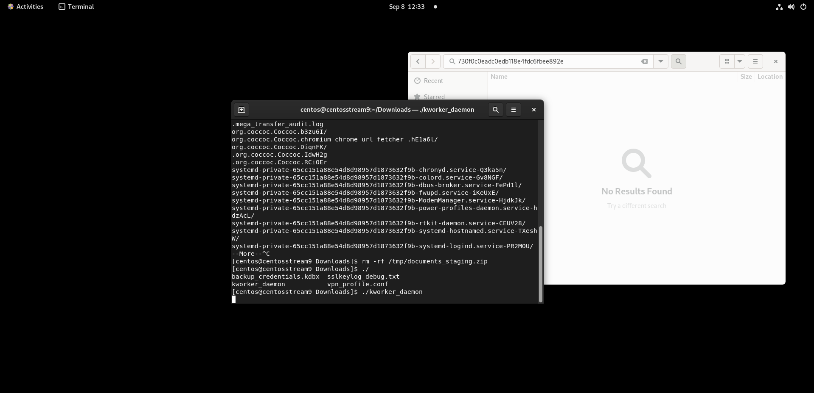
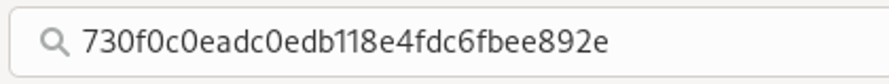

# CSCV 2026 — Insidotage — Full Write-up

> Dành cho người mới: [Bài học nhập môn và phương pháp tư duy điều tra](./LESSON.md)

## Đề bài

During routine network monitoring, our Security Operations Center (SOC) detected suspicious behavioral anomalies originating from an internal enterprise Linux workstation.

Suspecting a security breach, the Incident Response team swiftly isolated the host and captured a full physical memory image of the active machine before taking it offline.

As the lead digital forensics investigator on this case, your mission is to reconstruct the attack and uncover the key artifacts left behind in memory.

Determine the answers to the following questions:

1. What is the email address of the account containing the malware?
2. What is the sha-256 hash of the initial malware binary responsible for collecting target files? (lowercase)
3. What is the password to unlock the exfiltrated documents archive?
4. What is the md5 hash string visible in the image captured by the surveillance agent? (lowercase)

Once you have identified all four answers, construct the final flag using the following format:

`cscv2026{answer1_answer2_answer3_answer4}`

Submit the flag with answers in the exact order shown above.

**Tệp đề được cung cấp:** `dist/mem.dmp` và `dist/network.pcapng`.

## Thông tin chung

- **Giải:** CSCV 2026.
- **Thể loại:** Linux Memory Forensics, Malware Analysis, Network Forensics.
- **Hiện vật:** `mem.dmp` và `network.pcapng` trong thư mục `dist`.
- **Hệ thống được thu giữ:** CentOS Stream 9, kernel `5.14.0-22.el9.x86_64`; ảnh nhớ định dạng LiME.
- **Môi trường phân tích thực tế:** Windows PowerShell; WSL Ubuntu dùng cho `strings`, `readelf`, `nm` và `objdump`.
- **Công cụ chính:** Volatility 3, ripgrep, Python, Wireshark/tshark, binutils; bkcrack dùng cho một hướng kiểm chứng ZipCrypto bổ sung.
- **Phương pháp:** đọc hiện vật, phân tích tĩnh và giải mã dữ liệu đã thu giữ. Collector không được thực thi.
- **Trạng thái:** bốn đáp án đã có chứng cứ đối chiếu; flag được ghép từ các đáp án. Chưa ghi nhận kết quả chấm flag trên nền tảng của giải.

Các offset ghi cho `mem.dmp` trong bài là **offset byte trong tệp dump**, không phải địa chỉ vật lý RAM hay địa chỉ ảo của tiến trình. Địa chỉ hàm ELF và inode được ghi riêng theo ngữ cảnh.

## Mục lục

1. [Đề bài](#đề-bài)
2. [Chuẩn bị môi trường](#chuẩn-bị-môi-trường)
3. [Câu 1 — Email tài khoản chứa malware](#câu-1--email-tài-khoản-chứa-malware)
4. [Câu 2 — SHA-256 của collector ban đầu](#câu-2--sha-256-của-collector-ban-đầu)
5. [Câu 3 — Mật khẩu archive tài liệu](#câu-3--mật-khẩu-archive-tài-liệu)
6. [Câu 4 — Chuỗi MD5 trong ảnh giám sát](#câu-4--chuỗi-md5-trong-ảnh-giám-sát)
7. [Ghép flag](#ghép-flag)
8. [Kết luận](#kết-luận)

## Chuẩn bị môi trường

### Kiểm kê hiện vật

Thư mục làm việc của lần phân tích này là `D:\CTF\cscv`. Hai tệp đầu vào:

Khi dùng bản trong repo GitHub, đặt `$writeupDir` thành đường dẫn thư mục `for\LinuxMemory` đã clone. `$caseRoot` vẫn trỏ tới thư mục chứa hiện vật `dist` và kết quả phục hồi `scratch` trên máy phân tích.

| Tệp | Kích thước |
|---|---:|
| `mem.dmp` | 8.589.332.605 byte |
| `network.pcapng` | 1.003.199.776 byte |

Thiết lập biến trong PowerShell:

~~~powershell
$caseRoot = 'D:\CTF\cscv'
$memoryImage = Join-Path $caseRoot 'dist\mem.dmp'
$pcapFile = Join-Path $caseRoot 'dist\network.pcapng'
$outputDir = Join-Path $caseRoot 'scratch'
$symbolsDir = Join-Path $caseRoot 'tools\kernel-symbol'
$volatility = Join-Path $caseRoot '.venv-forensics\Scripts\vol.exe'
$pythonForensics = Join-Path $caseRoot '.venv-forensics\Scripts\python.exe'
$writeupDir = Join-Path $caseRoot 'writeups\CSCV2026-Linux-Memory'

Set-Location $caseRoot
Get-Item $memoryImage, $pcapFile | Select-Object Name, Length

$volBase = @('--offline', '-s', $symbolsDir,
             '-o', $outputDir, '-f', $memoryImage)
~~~

Volatility cần Linux symbol đúng kernel của ảnh nhớ. Lần phân tích này đã chuẩn bị symbol trong `tools\kernel-symbol`; không dùng một profile Linux bất kỳ. Nếu làm lại từ đầu, phải cung cấp symbol phù hợp trước khi chạy các plugin Linux.

### Định hướng chuỗi thực thi

Liệt kê tiến trình và tệp trong page cache:

~~~powershell
& $volatility @volBase linux.pslist.PsList
& $volatility @volBase linux.proc.Maps --pid 3624 3625
& $volatility @volBase linux.pagecache.Files --type REG > (Join-Path $outputDir 'files.tsv')

rg -n 'sys_audit_collector|kworker_daemon|\.bash_history|/etc/machine-id' `
  (Join-Path $outputDir 'files.tsv')
~~~

Lịch sử tải xuống Coccoc ghi `sys_audit_collector` dài **23.360 byte**, sau đó là `kworker_daemon` dài **8.596.320 byte**. Lịch sử shell được khôi phục từ inode `0x978f72411020`:

~~~powershell
& $volatility @volBase linux.pagecache.InodePages --inode 0x978f72411020 --dump
Get-Content (Join-Path $outputDir 'inode_0x978f72411020.dmp')
~~~

Các lệnh liên quan trong hiện vật:

~~~text
./sys_audit_collector
rm -rf sys_audit_collector
rm -rf /tmp/documents_staging.zip
./kworker_daemon
~~~

Đây là nội dung lịch sử được đọc để điều tra. Terminal trong RAM còn lưu thông báo collector đã đóng gói **39 tệp** vào `/tmp/documents_staging.zip`. PID 3624 chạy `kworker_daemon`; tiến trình con PID 3625 mang tên giống kernel worker và giữ ảnh màn hình trong heap.

Trình tự này phân biệt được **collector ban đầu** với **agent giám sát chạy sau đó**. PCAP có lưu lượng tới MEGA, nhưng TLS/SNI riêng lẻ không cho biết nội dung tệp được truyền.

Có thể khảo sát mạng bằng tshark; đường dẫn dưới đây là bản Wireshark đã có trên máy phân tích:

~~~powershell
$tshark = 'C:\Program Files\Wireshark\tshark.exe'
& $tshark -r $pcapFile -q -z io,phs
& $tshark -r $pcapFile -Y 'tls.handshake.extensions_server_name contains "mega"' `
  -T fields -e frame.number -e ip.src -e ip.dst `
  -e tls.handshake.extensions_server_name
~~~

---

## Câu 1 — Email tài khoản chứa malware

> **Question:** What is the email address of the account containing the malware?
>
> **Answer format:** địa chỉ email đầy đủ.

### 1. Câu hỏi đang yêu cầu gì?

Cần tìm tài khoản sở hữu thư mục/tệp malware trên MEGA. Một người dùng có thể xem thư mục được người khác chia sẻ, vì vậy email của phiên đang đăng nhập chưa đủ để trả lời.

### 2. Từ khóa quan trọng

- **account containing:** tài khoản chứa và sở hữu tệp.
- **malware:** liên kết với `sys_audit_collector`, không chọn một email bất kỳ trong RAM.
- **owner handle:** trường `u` của nút MEGA dùng để nối tệp với bản ghi người dùng.

### 3. Cần phân tích hiện vật nào?

- Metadata MEGA và bản ghi người dùng còn trong `mem.dmp`.
- Lịch sử tải xuống của Coccoc.
- Văn bản giao diện thư mục MEGA được chia sẻ còn trong bộ nhớ trình duyệt.

### 4. Từng bước thao tác

Sau khi xác định tên hai tệp từ lịch sử và tiến trình, tìm chúng cùng các email:

~~~powershell
rg -aob 'sys_audit_collector|kworker_daemon|[A-Za-z0-9._%+-]+@gmail\.com' `
  $memoryImage > (Join-Path $outputDir 'mail-and-malware-offsets.txt')
~~~

Không chọn email chỉ vì nó nằm gần một nhãn giao diện. Hãy đọc metadata của nút tệp rồi nối owner handle tới bảng người dùng. Các mốc trong bản dump này:

| Offset trong `mem.dmp` | Nội dung cần đọc |
|---|---|
| `0x1ea06aa0e` | File handle `4qpXAS4L` |
| `0x1ea06aa7e` | Tên `sys_audit_collector` |
| `0x1ea06aaa6` | Metadata chứa `"u":"WKgaKPK93KU"` |
| `0x1e9333eb3` | Bản ghi người dùng `WKgaKPK93KU` và email |
| `0x1e933404e` | Bản ghi của người đang xem thư mục, `E9g45elPHvo` |

Script offline kèm bài đọc những marker này và đối chiếu collector đã lưu:

~~~powershell
& $pythonForensics (Join-Path $writeupDir 'Scripts\audit_evidence.py') $caseRoot
~~~

### 5. Cách đọc kết quả

Trích lược quan hệ metadata đã xác minh:

~~~text
File:
  handle = 4qpXAS4L
  name   = sys_audit_collector
  parent = 4y5WRYDS
  owner  = WKgaKPK93KU
  size   = 23360

Parent folder:
  handle = 4y5WRYDS
  owner  = WKgaKPK93KU

User record in RAM:
  WKgaKPK93KU{"m":"tommyxiaomihackerbox@gmail.com", ...}
~~~

Như vậy ta có chuỗi chứng cứ:

~~~text
sys_audit_collector → WKgaKPK93KU → tommyxiaomihackerbox@gmail.com
~~~

Giao diện thư mục chia sẻ còn giữ `fm-share-email` với cùng địa chỉ, bổ sung cho quan hệ owner trong metadata.

### 6. Những giá trị dễ nhầm

- `orbitjacklane@gmail.com` ánh xạ tới `E9g45elPHvo`, là tài khoản đang truy cập thư mục được chia sẻ.
- `tjacklane@gmail.com` xuất hiện cạnh nhãn `current-email account-email` trong một mảnh giao diện. Lần phân tích đầu đã gán nhầm chuỗi này cho chủ malware.
- `WKgaKPK93KU` là handle người dùng, không phải email.
- `4qpXAS4L` là handle tệp; `4y5WRYDS` là handle thư mục.

### 7. Đáp án cuối cùng

~~~text
tommyxiaomihackerbox@gmail.com
~~~

---

## Câu 2 — SHA-256 của collector ban đầu

> **Question:** What is the sha-256 hash of the initial malware binary responsible for collecting target files? (lowercase)
>
> **Answer format:** 64 ký tự hex viết thường.

### 1. Câu hỏi đang yêu cầu gì?

Phải tính hash trên toàn bộ byte của **tệp collector gốc**. Hash của một vùng nhớ, một trang ELF hoặc tệp phục hồi còn thiếu dữ liệu sẽ là giá trị khác.

### 2. Từ khóa quan trọng

- **initial malware:** `sys_audit_collector`, được chạy trước agent giám sát.
- **collecting target files:** được xác nhận bởi terminal và logic quét tài liệu trong collector.
- **SHA-256/lowercase:** giữ đủ 64 ký tự, chuyển chữ hex về chữ thường.

### 3. Cần phân tích hiện vật nào?

- Lịch sử Coccoc và shell để xác định tên, kích thước, vai trò.
- Trang ELF còn trong RAM, lưu thành `D:\CTF\cscv\scratch\raw_cachepage_0.bin`.
- Tệp collector nguyên vẹn lưu thành `D:\CTF\cscv\scratch\sys_audit_collector_from_mega.elf`.

### 4. Từng bước thao tác

**Bước 1: loại tệp khôi phục không đầy đủ.**

Cache có tệp `/tmp/.org.coccoc.Coccoc.IdwH2g`, inode `0x978f68ecd020`, kích thước 23.360 byte. Trang đầu là ELF hợp lệ, nhưng các trang còn lại bị thiếu hoặc không còn thuộc đúng nội dung tệp. Không thể băm bản ghép này làm đáp án.

**Bước 2: ghi rõ nguồn tệp nguyên vẹn.**

Trong lần điều tra này, tệp đầy đủ được lấy lại qua MEGA dựa trên metadata tệp và dữ liệu phiên còn trong ảnh nhớ, rồi giải mã thành ELF 23.360 byte. Việc lấy lại diễn ra **sau khi thu giữ RAM** và phụ thuộc dịch vụ MEGA còn cung cấp tệp. Đây không phải một bản dựng đầy đủ chỉ từ page cache. Write-up lưu lại kết quả và phép đối chiếu offline; không chứa thông tin xác thực phiên trình duyệt.

**Bước 3: kiểm tra cấu trúc và nhận diện tệp.**

Trong WSL:

~~~bash
file /mnt/d/CTF/cscv/scratch/sys_audit_collector_from_mega.elf
readelf -h -l -S /mnt/d/CTF/cscv/scratch/sys_audit_collector_from_mega.elf
nm -n /mnt/d/CTF/cscv/scratch/sys_audit_collector_from_mega.elf
~~~

Các kiểm tra quan trọng:

- Tổng chiều dài: **23.360 byte**.
- ELF x86-64 có bảng program/section nằm trong giới hạn tệp.
- Entry point `0x401350` nằm trong một segment thực thi.
- Có các symbol `derive_runtime_password`, `add_file_to_zip`, `scan_and_add` và `finalize_zip`.
- **4.096 byte đầu khớp từng byte** với trang ELF độc lập trong RAM tại offset tệp `0x3401e040`.

Script `audit_evidence.py` kiểm tra các điều kiện trên với hiện vật đã lưu.

**Bước 4: tính SHA-256.**

~~~powershell
$collectorFile = Join-Path $outputDir 'sys_audit_collector_from_mega.elf'
(Get-FileHash -LiteralPath $collectorFile -Algorithm SHA256).Hash.ToLowerInvariant()
~~~

### 5. Cách đọc kết quả

Hash của đúng tệp nguyên vẹn là:

~~~text
9ec3d41b5db1baee571dbe1bebff4774b85d61e046edce96a86dd489644ce2e7
~~~

Việc khớp trang đầu giúp liên kết tệp lấy lại từ MEGA với collector đã tải trong ảnh nhớ. Phép kiểm tra ELF và kích thước loại được bản phục hồi hỏng. Logic của chương trình ở câu 3 tiếp tục xác nhận đây là chương trình tạo archive tài liệu.

### 6. Những giá trị dễ nhầm

- Không băm `kworker_daemon`: đó là agent chạy sau collector.
- Không băm `raw_cachepage_0.bin`: đây chỉ là một trang 4 KiB.
- Không lấy hash của các tệp có tên `collector_reassembled_23360.bin` hoặc `inode_0x978f68ecd020*.dmp` chỉ vì chúng có cùng kích thước.
- Ứng viên `4da1426c02e411769e4047984685cff988bcf65c008859ff23fd4f5d85f09361` từng được tính từ một bản ghép sai và đã bị loại.
- ELF magic `7f 45 4c 46` tự nó chưa chứng minh toàn bộ tệp đã được khôi phục.

### 7. Đáp án cuối cùng

~~~text
9ec3d41b5db1baee571dbe1bebff4774b85d61e046edce96a86dd489644ce2e7
~~~

---

## Câu 3 — Mật khẩu archive tài liệu

> **Question:** What is the password to unlock the exfiltrated documents archive?
>
> **Answer format:** giữ nguyên mật khẩu, kể cả chữ hoa và dấu gạch nối.

### 1. Câu hỏi đang yêu cầu gì?

Cần chuỗi mật khẩu mà collector dùng cho `/tmp/documents_staging.zip`. Một trạng thái khóa ZipCrypto khôi phục được không phải chính chuỗi mật khẩu mà đề yêu cầu.

### 2. Từ khóa quan trọng

- **password:** đầu vào của hàm khởi tạo ZipCrypto.
- **documents archive:** phải liên kết với ZIP chứa các mục `staged/` và đường dẫn do collector tạo.
- **unlock:** kiểm tra bằng cách giải mã dữ liệu và đối chiếu CRC32.

### 3. Cần phân tích hiện vật nào?

- Collector nguyên vẹn từ câu 2.
- `/etc/machine-id` của máy trong ảnh nhớ.
- ZIP local headers và ciphertext còn trong `mem.dmp`.
- Bản rõ `vault_backup.key` trong page cache, dùng cho hướng known plaintext bổ sung.

### 4. Từng bước thao tác

**Bước 1: tìm nơi tạo mật khẩu.**

Trong WSL:

~~~bash
nm -n /mnt/d/CTF/cscv/scratch/sys_audit_collector_from_mega.elf
objdump -s -j .rodata /mnt/d/CTF/cscv/scratch/sys_audit_collector_from_mega.elf
objdump -d -Mintel --start-address=0x401440 --stop-address=0x4015a0 \
  /mnt/d/CTF/cscv/scratch/sys_audit_collector_from_mega.elf
~~~

Hàm `derive_runtime_password` tại `0x401440`:

1. Đọc dòng đầu từ `/etc/machine-id`.
2. Nếu mở tệp thất bại, thử `/var/lib/dbus/machine-id`.
3. Nếu dữ liệu rỗng, dùng hostname.
4. Cắt ký tự CR/LF, trộn byte qua hai bộ tích lũy 32 bit.
5. Trộn tiếp hằng `K9-EXFIL-2026`.
6. Định dạng thành `VLT9-%08x-%08x`.

`main` gọi hàm này, mở `/tmp/documents_staging.zip` với chế độ `wb`, rồi truyền mật khẩu vào logic quét Documents, Desktop, Downloads và `/tmp`.

**Bước 2: phục hồi machine ID của máy nạn nhân.**

~~~powershell
& $volatility @volBase linux.pagecache.InodePages --inode 0x978f58b548a0 --dump
Get-Content (Join-Path $outputDir 'inode_0x978f58b548a0.dmp')
~~~

Kết quả:

~~~text
3601188fbcc04a5da1a59be3b5383dfb
~~~

Không đọc machine ID của máy phân tích. Inode trên thuộc `/etc/machine-id` trong ảnh nhớ đã thu giữ.

**Bước 3: mô phỏng phép tính, không chạy malware.**

~~~python
machine_id = b"3601188fbcc04a5da1a59be3b5383dfb"
salt = b"K9-EXFIL-2026"
mask = 0xffffffff
x = 0x811c9dc5
y = 0x55aa55aa

for byte in machine_id:
    x = ((x ^ byte) * 0x1000193) & mask
    y = ((y * 33) ^ byte) & mask

for byte in salt:
    y = ((y ^ byte) * 0x1000193) & mask
    x = ((x * 31) ^ byte) & mask

print(f"VLT9-{x:08x}-{y:08x}")
~~~

Bản script kèm bài nhận tệp machine ID làm đầu vào:

~~~powershell
& $pythonForensics (Join-Path $writeupDir 'Scripts\derive_password.py') `
  (Join-Path $outputDir 'inode_0x978f58b548a0.dmp')
~~~

**Bước 4: đối chiếu với ZIP thực.**

Sáu local headers liên tiếp trong dump bắt đầu tại các offset `0x1a8b26a`, `0x1a8b3f8`, `0x1a8b7a0`, `0x1a8ba51`, `0x1a8bc0b` và `0x1a8bc96`. Chúng dùng ZipCrypto và phương thức lưu không nén (`method=0`).

Script `verify_archive.py` đọc từng header, lấy đúng ciphertext, giải mã bằng mật khẩu và kiểm tra kích thước cùng CRC32:

~~~powershell
& $pythonForensics (Join-Path $writeupDir 'Scripts\verify_archive.py') `
  $memoryImage 'VLT9-35579852-2beeedad'
~~~

### 5. Cách đọc kết quả

Kết quả phép tính là `VLT9-35579852-2beeedad`. Những kiểm tra đã thực hiện trên sáu mục liên tiếp:

| Tên mục ZIP | Bản rõ | CRC32 khớp header |
|---|---:|---|
| `staged/vault_backup.key` | 333 byte | `f2072598` |
| `staged/candidate_keys.json` | 868 byte | `322dea82` |
| `staged/internal_master_vault.txt` | 615 byte | `318339e6` |
| `staged/customer_pii_vault_2026.csv` | 366 byte | `e26ee675` |
| `staged/q3_financial_audit_confidential.xlsx` | 54 byte | `209ac2dc` |
| `staged/incident_notes.txt` | 606 byte | `a002e914` |

Kiểm tra mở rộng xác nhận **21 trong 24 mục đã carve** có kích thước và CRC khớp. Ba mảnh bị đứt hoặc ghi đè ở ranh giới trang. Không khôi phục được toàn bộ archive 39 mục như một ZIP liên tục có EOCD hoàn chỉnh.

Một hướng điều tra trước đó dùng bản rõ 333 byte của `vault_backup.key` và bkcrack để khôi phục trạng thái khóa ban đầu `670e8462 306591b4 8372919d`. Điều này giúp đọc các mục ZIP, nhưng việc phân tích collector mới cho ra chuỗi mật khẩu gốc.

### 6. Những giá trị dễ nhầm

- `Winter2026!CorporateAccess#` nằm trong ghi chú mồi nhử và không giải mã ZIP với CRC hợp lệ.
- Các chuỗi `FLAG{...}` và chỉ dẫn trong tài liệu phục hồi là nội dung hiện vật, không phải kết luận điều tra.
- Machine ID, hằng `K9-EXFIL-2026` và ba số khóa ZipCrypto đều không phải mật khẩu cuối.
- Cần giới hạn phép tính về 32 bit sau mỗi bước; số nguyên Python không tự tràn như các thanh ghi 32 bit.
- CRC đúng chứng minh giải mã đúng mục ZIP; nội dung có câu “flag thật” vẫn cần được đánh giá riêng.

### 7. Đáp án cuối cùng

~~~text
VLT9-35579852-2beeedad
~~~

---

## Câu 4 — Chuỗi MD5 trong ảnh giám sát

> **Question:** What is the md5 hash string visible in the image captured by the surveillance agent? (lowercase)
>
> **Answer format:** 32 ký tự hex viết thường.

### 1. Câu hỏi đang yêu cầu gì?

Đề hỏi chuỗi được hiển thị trong ảnh do agent chụp. Cần phục hồi PNG và đọc nội dung trên màn hình; không tính MD5 của chính tệp PNG.

### 2. Từ khóa quan trọng

- **visible in the image:** nội dung nhìn thấy trong ảnh.
- **surveillance agent:** agent chạy ở PID 3625, sau collector.
- **MD5 string/lowercase:** đọc đủ 32 ký tự hex.

### 3. Cần phân tích hiện vật nào?

- Bản đồ bộ nhớ PID 3625.
- VMA heap `0x60e000–0x841000` của tiến trình này.
- PNG được carve từ heap, đã lưu tại `D:\CTF\cscv\scratch\heap_screen_0x192f30.png`.

### 4. Từng bước thao tác

Xem map và chỉ dump VMA chứa địa chỉ `0x60e000`:

~~~powershell
& $volatility @volBase linux.proc.Maps --pid 3625
& $volatility @volBase linux.proc.Maps --pid 3625 --address 0x60e000 --dump
~~~

Tệp dump của VMA trong lần phân tích này:

~~~text
D:\CTF\cscv\scratch\pid.3625.vma.0x60e000-0x841000.dmp
~~~

Tìm chữ ký PNG `89 50 4e 47 0d 0a 1a 0a` rồi đọc độ dài các chunk đến `IEND`. Script kèm bài làm thao tác này trên VMA đã dump:

~~~powershell
& $pythonForensics (Join-Path $writeupDir 'Scripts\carve_png.py') `
  (Join-Path $outputDir 'pid.3625.vma.0x60e000-0x841000.dmp') `
  (Join-Path $outputDir 'png-from-heap')
~~~

Ảnh cần đọc bắt đầu tại offset `0x192f30` **trong tệp VMA heap**, không phải trong `mem.dmp`. Ảnh có kích thước **1918×928** và cho thấy terminal đang chạy `./kworker_daemon`.

### 5. Cách đọc kết quả

Ảnh màn hình phục hồi:

Trong cửa sổ quản lý tệp, ô tìm kiếm chứa chuỗi MD5. Vùng chữ được phóng to trong hiện vật đã lưu:

Đọc trực tiếp được:

~~~text
730f0c0eadc0edb118e4fdc6fbee892e
~~~

### 6. Những giá trị dễ nhầm

- `Get-FileHash ... -Algorithm MD5` trên PNG sẽ băm byte của ảnh, không trả lời câu hỏi.
- Không lấy một chuỗi 32 ký tự khác chỉ vì nó xuất hiện gần chữ ký PNG trong RAM.
- Phân biệt `0` với `o`, `1` với `l`; xem ảnh đủ lớn và kiểm tra chuỗi có đúng 32 ký tự hex.
- Nếu chạy lại Volatility trong thư mục đã có output, tên dump có thể được thêm hậu tố; chọn đúng VMA trước khi carve.

### 7. Đáp án cuối cùng

~~~text
730f0c0eadc0edb118e4fdc6fbee892e
~~~

---

## Ghép flag

Đề yêu cầu nối trực tiếp bốn đáp án, đúng thứ tự và phân cách bằng dấu `_`. Không băm lại chuỗi đã nối.

~~~python
answers = [
    "tommyxiaomihackerbox@gmail.com",
    "9ec3d41b5db1baee571dbe1bebff4774b85d61e046edce96a86dd489644ce2e7",
    "VLT9-35579852-2beeedad",
    "730f0c0eadc0edb118e4fdc6fbee892e",
]
print("cscv2026{" + "_".join(answers) + "}")
~~~

Flag ghép từ các đáp án đã xác minh:

~~~text
cscv2026{tommyxiaomihackerbox@gmail.com_9ec3d41b5db1baee571dbe1bebff4774b85d61e046edce96a86dd489644ce2e7_VLT9-35579852-2beeedad_730f0c0eadc0edb118e4fdc6fbee892e}
~~~

## Kết luận

| Câu | Kết luận | Bằng chứng chính | Kiểm chứng chéo |
|---:|---|---|---|
| 1 | Email chủ malware | Nút MEGA → owner handle → bản ghi email trong RAM | Giao diện thư mục chia sẻ và metadata thư mục cha |
| 2 | SHA-256 collector | ELF nguyên vẹn lấy lại từ MEGA | 23.360 byte, ELF hợp lệ, trang đầu khớp RAM |
| 3 | Mật khẩu ZIP | `derive_runtime_password` + machine ID nạn nhân | Giải mã các mục `staged/`, kích thước và CRC32 |
| 4 | MD5 hiển thị | PNG trong heap PID 3625 | Xem toàn ảnh và đối chiếu vùng chữ |

Chuỗi hành vi được tái dựng từ hiện vật:

~~~text
MEGA shared folder
→ sys_audit_collector
→ thu thập tài liệu và tạo documents_staging.zip có mật khẩu
→ xóa collector cùng ZIP staging
→ kworker_daemon / tiến trình giám sát
→ PNG màn hình còn trong heap
~~~

Điểm quyết định của bài là nối các hiện vật theo đúng vai trò: owner khác viewer, ELF đầy đủ khác bản carve thiếu trang, mật khẩu khác trạng thái khóa và nội dung ảnh khác hash tệp ảnh. PCAP hỗ trợ bối cảnh MEGA; các kết luận cuối dựa vào metadata, cấu trúc tệp, mã collector và dữ liệu giải mã.

**Bố cục tham khảo:** [Blindsided — FIA 2026 Technical Write-ups](https://github.com/FIA-FPT-Information-Assurance-Club/2026-Technical-Write-ups/tree/main/Pwnsec%20CTF%202026/Forensics/Blindsided). Phần giải thích, chứng cứ và mã trong bài này được viết cho hiện vật CSCV.
