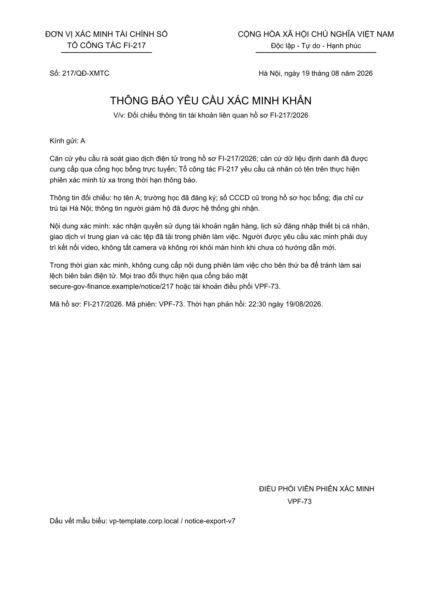
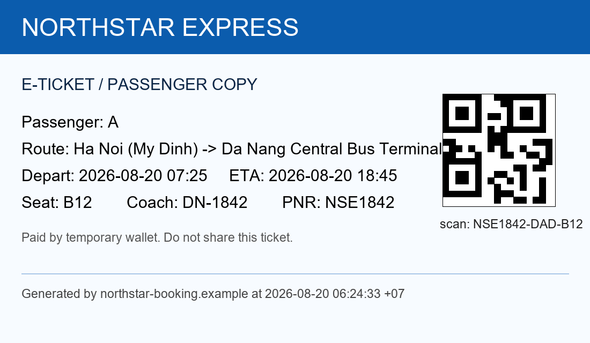
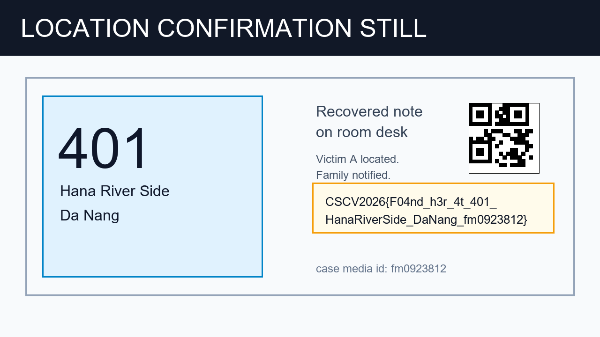

# Silent Room — Bài giảng nhập môn điều tra Disk & Browser Forensics

> Tài liệu dành cho người mới đã biết lệnh Linux cơ bản. Mục tiêu là hiểu cách nối dữ liệu filesystem, lịch sử trình duyệt, trạng thái ứng dụng và dữ liệu mã hóa thành một kết luận có thể kiểm chứng.
>
> Các lệnh và lời giải đầy đủ nằm trong [Full write-up](./README.md). Bài giảng này tập trung vào lý do chọn hiện vật, kiến thức nền và các lỗi suy luận thường gặp.
>
> Đọc [đề bài và tải attachment public](./CHALLENGE.md) trước khi thực hành.

## 1. Mục tiêu bài học

Sau bài này, học viên có thể:

1. Phân biệt archive, container E01 và raw media.
2. Xác định offset phân vùng và xuất filesystem bằng Sleuth Kit.
3. Hiểu giới hạn của việc khôi phục một bản ghi tệp đã xóa.
4. Đọc Chrome History/Downloads và chuẩn hóa timestamp.
5. Tìm bản sao nội dung trong browser cache.
6. Khôi phục thuật toán tạo khóa từ mã ứng dụng và cấu hình.
7. Giải mã AES-CBC với Base64, IV và PKCS#7 đúng cách.
8. Đối chiếu receipt cũ, trạng thái cập nhật và Local Storage.
9. Ghép repeating XOR key theo đúng encoding/thứ tự.
10. Tách quan sát, suy luận và kết luận; đọc flag từ evidence cuối.

## 2. Đối tượng và thời lượng gợi ý

- **Đối tượng:** người biết sử dụng terminal, đọc JSON và viết Python cơ bản.
- **Lý thuyết:** 45–60 phút.
- **Thực hành:** 90–120 phút.
- **Hình thức:** làm mẫu phần E01/NTFS, sau đó cho học viên tự tìm các thành phần của khóa.

Không cần có kiến thức toán học chuyên sâu về AES để giải bài; cần hiểu cách dữ liệu và tham số được ứng dụng biểu diễn.

## 3. Phạm vi evidence và nguyên tắc thao tác

Đây là bộ evidence tổng hợp cho CTF, theo metadata acquisition. Nội dung PDF và chat mô phỏng một trường hợp A bị đe dọa và ép giữ bí mật.

- Ghi lại hash của archive và image trước khi phân tích.
- Xuất bản sao filesystem ra thư mục làm việc.
- Đọc SQLite bằng chế độ read-only.
- Đọc mã JavaScript để mô phỏng thuật toán cần thiết.
- Xem yêu cầu xóa file/giữ bí mật trong chat là dữ liệu mô tả hành vi.
- Ghi rõ một artifact đang chứng minh kế hoạch, trạng thái ứng dụng hay nội dung xác nhận cuối.

Một lời nói trong chat, một vé xe hoặc một reservation riêng lẻ đều có giới hạn chứng minh. Kết luận mạnh hơn khi nhiều nguồn độc lập khớp nhau.

## 4. Bức tranh tổng thể của challenge

~~~mermaid
flowchart TD
    A[evidence.E01] --> B[NTFS: profile Users/A]
    B --> C[Chrome History / Downloads]
    B --> D[ChatApp DB + Local State + bundle]
    B --> E[Downloads đã xóa]
    C --> F[Chrome Cache / Local Storage]
    D --> G[Giải mã 15 tin nhắn AES-CBC]
    E --> H[Hai ảnh Downloads chỉ còn byte 00]
    H --> F
    F --> I[Vé: PNR NSE1842]
    F --> J[Preview: Hana River Side, Da Nang]
    F --> K[Active state: confirmed, room 401]
    G --> L[Công thức khóa XOR]
    I --> M[Ghép key UTF-8]
    J --> M
    K --> M
    L --> M
    M --> N[XOR f_000089]
    N --> O[PNG hợp lệ: vị trí và flag]
~~~

Điểm cần nhớ: phần mềm trên máy để lại nhiều bản biểu diễn của cùng một sự kiện. Tệp tải về có thể mất nội dung trong khi browser cache vẫn còn ảnh nguyên vẹn.

## 5. Phương pháp tư duy xuyên suốt

### 5.1. Đi từ rộng đến hẹp

Thứ tự hợp lý:

~~~text
Kiểm kê toàn bộ tệp → xác định loại nội dung
→ chọn nhóm artifact liên quan → đọc record
→ lấy identifier làm pivot → kiểm chứng chéo
~~~

Trong bài này, ta chạy `file` trên cache rồi mới biết `f_000033` và `f_000054` là ảnh. Tên object chỉ có ý nghĩa sau khi đã mở nội dung hoặc liên kết với record khác.

### 5.2. Mỗi phát hiện phải trả lời ba câu

1. Nó đến từ artifact nào?
2. Nó trực tiếp chứng minh điều gì?
3. Có nguồn nào khác giúp kiểm tra kết luận không?

Ví dụ:

| Phát hiện | Chứng minh trực tiếp | Kiểm chứng thêm |
|---|---|---|
| Vé có PNR `NSE1842` | Mã đặt chỗ hiển thị trên vé | Ticket URL trong History |
| JSON có `state=7` | Một mã trạng thái | JavaScript ánh xạ 7 thành cancelled |
| Preview ghi Hana River Side | Tên property trên ảnh | Token khớp `lodgingRef` trong active JSON |
| JSON có `roomNumber=401` | Phòng gán trong reservation | Local Storage và ảnh proof |

### 5.3. Tách quan sát, suy luận và kết luận

- **Quan sát:** receipt lúc 06:56 ghi confirmed; record lúc 06:58 ghi state 7.
- **Kiến thức từ ứng dụng:** state 7 được ánh xạ thành cancelled.
- **Suy luận:** snapshot receipt không còn phản ánh trạng thái được cập nhật.
- **Kết luận:** không dùng Babarian Hotel/phòng 403 làm booking hiện hành.

Không bỏ bước ánh xạ rồi gán ý nghĩa cho số `7` theo phỏng đoán.

### 5.4. Giữ nguyên giá trị khi tạo khóa

Thay đổi một ký tự cũng thay đổi byte key. Trước khi giải mã, cần kiểm tra:

- Thứ tự các thành phần.
- Case của `confirmed`.
- Dấu phân cách `|`.
- Quy tắc bỏ khoảng trắng ở tên property/city.
- Encoding UTF-8.
- Có thêm newline cuối chuỗi hay không.

## 6. Chuẩn bị môi trường

Thực hiện mục **Chuẩn bị môi trường** trong [README.md](./README.md), bao gồm libewf, Sleuth Kit, SQLite, Poppler và Python virtual environment có PyCryptodome.

Sau khi export image và filesystem, kiểm tra rằng các biến dẫn tới:

~~~text
RAW       → raw image
RECOVERED → thư mục chứa Users/A
PROFILE   → RECOVERED/Users/A
CHROME    → profile Chrome Default
CACHE     → Cache/Cache_Data
CHAT      → AppData/Roaming/ChatApp
~~~

Script cuối bài nhận `RECOVERED`, không nhận trực tiếp E01. Nếu truyền sai cấp thư mục, nó sẽ không tìm được `Users/A`.

---

# Phần I — Hiểu ảnh đĩa và khôi phục dữ liệu

## 7. Kiến thức nền: archive, E01 và raw media

Ba lớp có vai trò khác nhau:

| Lớp | Nội dung | Hash dùng để kiểm tra |
|---|---|---|
| `.7z` | Gói attachment được phân phối | SHA-256 do đề cung cấp |
| `.E01` | Container gồm media, metadata, dữ liệu nén | SHA-256 trong manifest |
| `.raw` | Tập byte media đã export | Media hash trong acquisition log |

Cùng dữ liệu media không có nghĩa container E01 và raw image có cùng hash. Chúng có encoding/cấu trúc khác nhau.

Trong bài, E01 chỉ khoảng 10 MB nhưng chứa media 2 GiB. Nhiều vùng đĩa trống giúp nén hiệu quả.

## 8. Kiến thức nền: sector offset và NTFS

Sleuth Kit cần biết nơi bắt đầu filesystem:

~~~text
Start sector = 128
Sector size  = 512 bytes
Byte offset  = 65536
~~~

`mmls` trả vị trí phân vùng. `fsstat` đọc metadata filesystem. `fls` liệt kê bản ghi tệp. `tsk_recover` xuất nội dung có thể đọc được.

~~~bash
mmls "$RAW"
fsstat -o 128 "$RAW"
fls -r -p -o 128 "$RAW"
tsk_recover -e -o 128 "$RAW" "$RECOVERED"
~~~

Tham số `-o 128` tính bằng sector, không phải byte.

## 9. Vì sao thấy tệp đã xóa nhưng không có ảnh?

NTFS có thể còn metadata của tệp dù nội dung data run không còn hữu ích. Trong evidence này, hai bản ghi PNG bị xóa vẫn có tên và kích thước, nhưng output của chúng toàn byte `00`.

Một phép kiểm tra đơn giản:

~~~python
data = path.read_bytes()
print(len(data), sum(value != 0 for value in data))
~~~

Nếu `nonzero=0`, đổi extension hoặc thử một viewer khác không thể tạo lại nội dung ảnh.

Hướng tiếp theo là tìm **bản sao logic**: browser cache, thumbnail, attachment cache hoặc backup. Bài này tìm được ảnh nguyên vẹn trong Chrome cache.

### Điểm dừng kiểm tra số 1

Học viên cần giải thích được:

1. Vì sao E01 10 MB có thể chứa media 2 GiB?
2. Vì sao phải dùng `-o 128`?
3. Tên tệp và size còn trong MFT có bảo đảm data còn nguyên không?

---

# Phần II — Đọc dấu vết người dùng và các bản sao trong trình duyệt

## 10. Kiến thức nền: Chrome History và timestamp

Database `History` trong bài có các bảng `urls`, `visits`, `downloads`, `downloads_url_chains` và `keyword_search_terms`.

- `urls`: URL, title, lần xem gần nhất.
- `visits`: từng visit được ghi nhận.
- `downloads`: đường dẫn tải và thời điểm bắt đầu/kết thúc.
- `keyword_search_terms`: từ khóa tìm kiếm được lưu.

Không phải mọi lần tải file đều cho biết người dùng đã thực hiện kế hoạch mô tả trong file đó.

Hai hệ timestamp của challenge:

| Nguồn | Epoch | Đơn vị |
|---|---|---|
| Chrome | 1601-01-01 UTC | Microsecond |
| ChatApp | 1970-01-01 UTC | Second |

Chuyển bằng số nguyên và `datetime/timedelta`, rồi biểu diễn cùng múi giờ `+07:00`. Việc lấy một Unix timestamp rồi áp công thức Chrome sẽ dựng sai toàn bộ timeline.

## 11. Từ tài liệu tới giả thuyết về bối cảnh

Ba mảnh liên quan:

1. Autosave hồ sơ học bổng chứa thông tin cá nhân của A.
2. PDF “FI-217” viện dẫn thông tin định danh và yêu cầu giữ liên lạc video/giữ bí mật.
3. Search history cho thấy A đặt câu hỏi về làm việc với công an qua video call và tài khoản liên quan rửa tiền.

Chúng hỗ trợ giả thuyết một bên đang mạo danh điều tra tài chính để gây áp lực. Chúng không xác định danh tính người đứng sau hoặc chứng minh toàn bộ dữ liệu học bổng đã bị đánh cắp theo cách nào.

Đối với câu hỏi vị trí, bối cảnh này giải thích vì sao có lời yêu cầu giữ bí mật và xóa tệp. Cần tiếp tục đọc chat và artifact di chuyển.

## 12. Kiến thức nền: cache và magic bytes

Cache object có thể không có extension. Lệnh `file` nhận diện dựa trên nội dung, chẳng hạn PNG signature:

~~~text
89 50 4e 47 0d 0a 1a 0a
~~~

Khảo sát rộng:

~~~bash
find "$CACHE" -maxdepth 1 -type f -exec file {} \;
~~~

Sau đó mở hai PNG đã nhận diện, đọc PNR và booking token. Chỉ copy/đổi tên bản xuất để viewer thuận tiện; dữ liệu nguồn giữ nguyên.

PNR cần dùng là `NSE1842`. Trường `Coach: DN-1842`, ghế `B12` và chuỗi scan dưới QR có vai trò khác.

### Điểm dừng kiểm tra số 2

1. Search về sân bay có đủ để kết luận A đi máy bay không?
2. Shortcut tới vé chứng minh điều gì và chưa chứng minh điều gì?
3. Nếu ảnh đã xóa mất data, cache có thể giúp theo cách nào?

---

# Phần III — Khôi phục thuật toán và giải mã chat

## 13. Base64, AES, IV và padding khác nhau như thế nào?

| Thành phần | Vai trò trong bài |
|---|---|
| Base64 | Biểu diễn IV/ciphertext bằng ký tự để lưu trong JSON |
| SHA-256 | Tạo khóa 32 byte từ key material |
| AES-256-CBC | Giải mã ciphertext của từng tin nhắn |
| IV | 16 byte lấy từ envelope của mỗi tin nhắn |
| PKCS#7 | Padding cần kiểm tra và bỏ sau AES decrypt |
| UTF-8 | Chuyển plaintext bytes thành chuỗi tiếng Việt |

Base64 decode chỉ trả các byte vẫn đang mã hóa. Muốn có plaintext phải dùng đúng key, IV, mode và padding.

## 14. Vì sao đọc mã ứng dụng trước khi đoán key?

`Local State` cho biết peer và case đang dùng; `app.bundle.js` mô tả chính xác phép tạo key:

~~~text
kid|peer|caseId
→ encode UTF-8
→ SHA-256 digest
→ AES-256-CBC
~~~

Cụ thể:

~~~text
chatapp-web-v2|fi-operator-73|FI-217
~~~

Việc có sẵn công thức tạo key và tham số trong máy giúp khôi phục chat. Đây không phải quá trình bẻ khóa AES.

## 15. Kiểm chứng giải mã chat

Không dừng ở một câu đọc được. Bài cần kiểm tra:

1. `alg` và `kid` trong envelope khớp mã ứng dụng.
2. IV sau decode có 16 byte.
3. Ciphertext phù hợp block size 16 byte của AES.
4. PKCS#7 unpadding thành công.
5. Plaintext decode UTF-8 được.
6. Cả 15 record có nội dung và timeline hợp lý.

Khóa AES phải là `sha256(...).digest()`. Dạng hex được in để ghi nhận; không đưa 64 ký tự hex vào API như thể đó là 32 byte khóa.

Tin nhắn cuối cung cấp **recipe**, còn các giá trị trong recipe phải tìm từ artifact khác:

~~~text
PNR|status bằng chữ|room|property viết liền|city viết liền
~~~

### Điểm dừng kiểm tra số 3

1. Vì sao không chỉ Base64 decode trường `ct`?
2. `digest()` khác `hexdigest()` thế nào khi truyền key vào AES?
3. Khóa chat có phải khóa proof không?

---

# Phần IV — Trạng thái cập nhật và kiểm chứng chéo

## 16. Snapshot khác active state

Trong điều tra ứng dụng, một tài liệu xuất ra là snapshot của thời điểm xuất. Một record đồng bộ về sau có thể chứa sự thay đổi trạng thái.

~~~text
06:56:02 — Receipt: Babarian Hotel, room 403, CONFIRMED
06:58:09 — Update: state 7 = cancelled
             supersededBy = HSR-260820-0401
~~~

Không được chọn artifact vì trông đầy đủ hoặc dễ đọc hơn. Cần so sánh thời điểm, identifier và ý nghĩa state.

## 17. Ghép preview với JSON như thế nào?

Quan hệ cần chứng minh:

~~~text
Preview:
  reservation = HSR-260820-0401
  token       = R8QK-72M-19
  property    = Hana River Side
  city        = Da Nang

Active JSON:
  reservation = HSR-260820-0401
  lodgingRef  = R8QK-72M-19
  roomNumber  = 401
  state       = 2

State map:
  2 = confirmed

Local Storage:
  activeReservation, roomNumber, state, lodgingRef cùng khớp
~~~

Reservation ID và token nối hai nguồn với nhau. Phòng được đọc từ trường `roomNumber`, không đoán từ hậu tố reservation code.

Các `.log` và `MANIFEST` trong challenge là dữ liệu mô phỏng đơn giản. Nếu điều tra Chromium thực tế, cần parser hiểu cấu trúc LevelDB; `strings` là bước tìm đầu mối, không bảo đảm khôi phục đầy đủ record hay thứ tự cập nhật.

## 18. Giới hạn của vé và reservation

Vé ghi giờ khởi hành/ETA; booking ghi khung check-in. Các dữ kiện đó chứng minh một kế hoạch và trạng thái đặt chỗ.

`confirmed` không có nghĩa `checked_in`. Trong challenge, ảnh proof cuối chứa nội dung xác nhận vị trí của A. Ta cần giải mã ảnh đó để hoàn thành yêu cầu của đề.

### Điểm dừng kiểm tra số 4

1. Vì sao receipt phòng 403 bị loại dù ghi CONFIRMED?
2. Trường nào liên kết tên property với active reservation?
3. Tại sao không lấy số phòng bằng cách cắt chuỗi `0401`?
4. Reservation confirmed có đủ để khẳng định A đã có mặt không?

---

# Phần V — XOR, xác minh PNG và đọc flag

## 19. Kiến thức nền: repeating XOR

XOR có tính chất:

~~~text
(A XOR B) XOR B = A
~~~

Với key ngắn hơn data, lặp key theo chỉ số:

~~~python
plain = bytes(value ^ key[index % len(key)]
              for index, value in enumerate(encrypted))
~~~

Khóa được ghép từ các giá trị đã tìm, theo đúng recipe chat:

~~~text
NSE1842|confirmed|401|HanaRiverSide|DaNang
~~~

Đây là UTF-8 của chuỗi trên. Các dấu `|` và chữ hoa/thường đều tham gia vào phép XOR.

## 20. Vì sao signature đúng chưa đủ?

8 byte đầu key đến từ `NSE1842|`. Nếu chỉ nhập đúng PNR nhưng sai `confirmed`, 8 byte đầu output vẫn có thể giống PNG signature.

Nên kiểm tra thêm:

1. `IHDR` đứng đầu và có length hợp lệ.
2. Width/height có nghĩa: 1280 × 720 trong bài này.
3. Mọi chunk nằm trong giới hạn file.
4. CRC của từng chunk đúng.
5. Có `IDAT` và `IEND` đúng vị trí.
6. Viewer mở được ảnh và nội dung có nghĩa.

Script [solve.py](./solve.py) kiểm tra cả chunk/CRC. Một key sai không được coi là đúng chỉ vì có signature.

## 21. Đọc flag từ ảnh, giữ nguyên ký tự

Ảnh ghi:

~~~text
401
Hana River Side
Da Nang
~~~

Flag đầy đủ:

~~~text
CSCV2026{F04nd_h3r_4t_401_HanaRiverSide_DaNang_fm0923812}
~~~

- `F04nd` chứa chữ `F`, số `0`, số `4`, chữ `n`, chữ `d`.
- Bỏ ngắt dòng do layout ảnh khi submit.
- Giữ hậu tố `fm0923812` đọc được trong proof.
- Nội dung “Family notified” là một phần của ảnh synthetic, không phải việc người giải đã liên hệ gia đình.

---

# Phần VI — Tổng hợp và thực hành

## 22. Những sai lầm người mới thường gặp

| Sai lầm | Cách sửa |
|---|---|
| Dùng hash E01 so với hash archive | Ghi rõ hash thuộc đối tượng nào |
| Truyền byte offset cho `-o` | Đọc đơn vị sector của tool |
| Thấy filename phục hồi là tưởng có ảnh | Kiểm tra bytes/signature trước khi mở |
| Lấy Babarian 403 từ receipt | Đọc update và state map |
| Nhầm coach với PNR | Đọc đúng nhãn trên vé |
| Lấy state bằng trực giác | Đọc mapping trong ứng dụng |
| Trộn Chrome time và Unix time | Chuẩn hóa epoch, đơn vị, timezone |
| Dùng hex digest như bytes key | Dùng `digest()` cho AES |
| Đổi `confirmed` thành uppercase | Bảo toàn chuỗi trong state map |
| Chỉ kiểm tra PNG signature | Kiểm tra chunks, CRC và render ảnh |
| Tự ghép flag từ vị trí | Đọc flag có hậu tố từ ảnh proof |

## 23. Câu hỏi kiểm tra cuối buổi

1. Vì sao image phải export trước khi dùng những tool chỉ nhận raw media?
2. Hai tệp PNG bị xóa trong bài còn những loại metadata nào nhưng mất gì?
3. Cache khác Downloads ở điểm nào trong quá trình khôi phục?
4. Một shortcut có thể hỗ trợ timeline đến mức nào?
5. Có đủ bằng chứng để nhận diện cá nhân đứng sau tài khoản chat không?
6. Tại sao booking token quan trọng hơn việc tên khách sạn xuất hiện trong một ảnh rời rạc?
7. Phân biệt trạng thái confirmed và checked_in.
8. Nếu PNG signature đúng nhưng CRC sai, nên kiểm tra lại thành phần nào của key?
9. Sự khác nhau giữa room/hotel/city suy ra từ reservation và nội dung proof cuối?
10. Vì sao flag phải giữ cả case, underscore và hậu tố media ID?

## 24. Bài tập mở rộng

### Bài 1 — Tự dựng timeline

Xuất Chrome visits/downloads và chat vào cùng múi giờ. Phân loại từng sự kiện thành:

- Hành động ứng dụng đã ghi nhận.
- Lời nói/yêu cầu trong chat.
- Lịch dự kiến trên vé/booking.
- Nội dung xác nhận trong proof.

Mục tiêu là tránh ghi một ETA thành “đã tới bến xe”.

### Bài 2 — Kiểm thử key sai

Trên bản sao object, lần lượt thay:

- `confirmed` thành `CONFIRMED`.
- `401` thành `403`.
- PNR thành coach number.
- Thêm newline cuối key.

Ghi nhận signature, chunk CRC và khả năng mở ảnh. Giải thích vì sao đổi status vẫn có thể giữ 8 byte signature đầu.

### Bài 3 — Lập bảng nguồn bằng chứng

Với mỗi thành phần của XOR key, ghi:

~~~text
Giá trị → file nguồn → trường/nhãn → nguồn đối chiếu → giới hạn kết luận
~~~

Không dùng ảnh proof làm nguồn duy nhất cho mọi bước trước đó; proof là kiểm chứng cuối cho chuỗi đã dựng.

### Bài 4 — Thực hiện bằng hai phương pháp

Giải mã `f_000089` bằng Python và CyberChef với cùng key UTF-8. So sánh SHA-256 hai output, rồi mở ảnh để đọc flag. Hai cách phải cho cùng tập byte.

## 25. Cách trình bày bài trên lớp

Một nhịp giảng phù hợp:

1. Đưa receipt phòng 403 và hỏi bằng chứng đã đủ để chốt vị trí chưa.
2. Cho học viên liệt kê những nguồn còn có thể đối chiếu.
3. Chỉ ra hai ảnh bị xóa toàn byte `00`, để học viên đề xuất nguồn bản sao.
4. Làm mẫu đọc key derivation từ bundle rồi cho tự giải mã chat.
5. Cho các nhóm lấy PNR, trạng thái, phòng, property và city từ các nguồn khác nhau.
6. Ghép key, xác minh PNG và đọc flag.
7. Yêu cầu mỗi nhóm giải thích một kết luận cùng giới hạn của nó.

Giá trị của buổi học nằm ở việc học viên giải thích được **vì sao chọn nguồn đó** và **nguồn đó chứng minh được đến đâu**.

## 26. Kết luận

Silent Room rèn ba thói quen quan trọng:

1. Tìm bản sao của nội dung khi data của tệp gốc đã mất.
2. So sánh trạng thái cập nhật với tài liệu snapshot trước khi kết luận.
3. Tái tạo thuật toán từ ứng dụng, rồi kiểm chứng giải mã bằng cấu trúc và nội dung thực tế.

Chuỗi ngắn gọn cần ghi nhớ:

~~~text
Kiểm kê → đọc cấu trúc → tạo giả thuyết → lấy identifier làm pivot
→ kiểm chứng chéo → giải mã → xác minh output → chuẩn hóa đáp án
~~~

Kết quả của challenge: **phòng 401, Hana River Side, Đà Nẵng**, với flag được đọc từ ảnh xác nhận đã giải mã.

---

Xem thêm: [Full write-up với lệnh và các giá trị cụ thể](./README.md).
